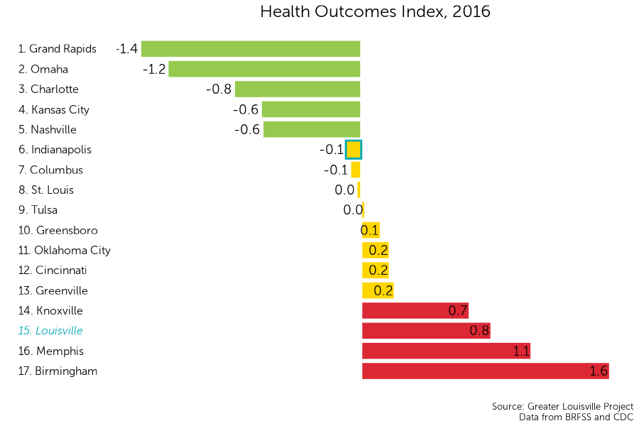
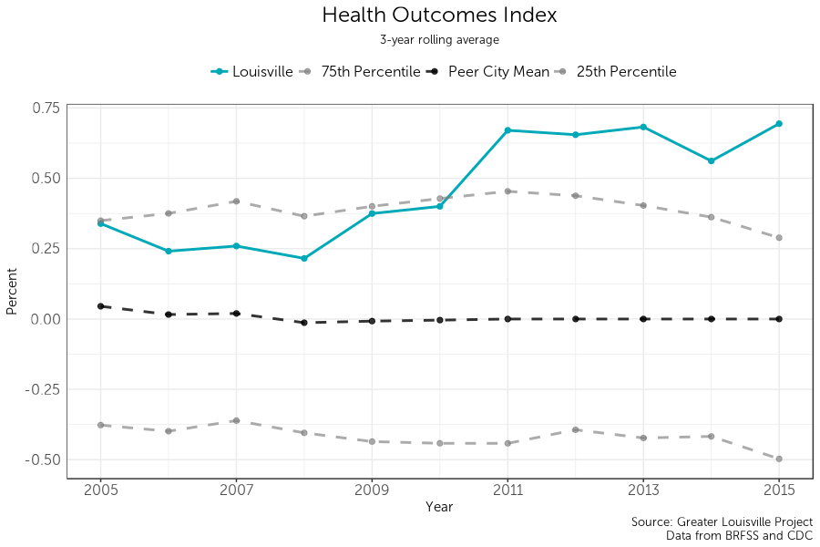
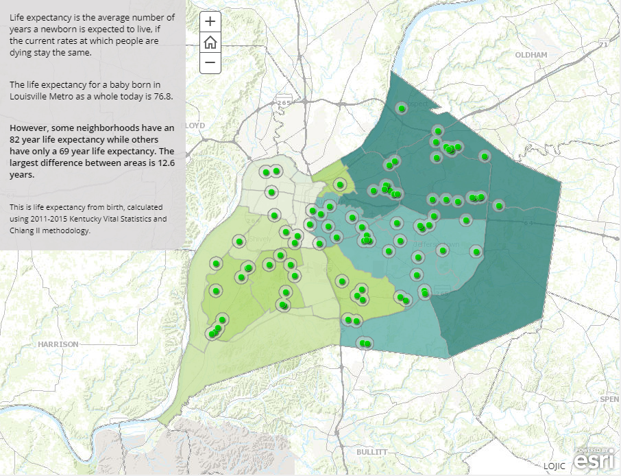

<div style="margin-top:50px;">
</div>
```{r "setup", include = FALSE}
knitr::opts_knit$set(root.dir = "C:/Users/Harrison Kirby/Desktop/GLP/ccu18")
knitr::opts_chunk$set(message = FALSE, warning = FALSE, echo = FALSE, fig.showtext=TRUE)
```

```{r libraries}
#Data
library(survey)
library(tidyverse)
library(magrittr)
library(feather)
library(labelled)

#Graphing
library(ggthemes)
library(classInt)
library(showtext)
library(reshape2)
library(rbokeh)
library(wesanderson)
library(kableExtra)
library(scales)

#Mapping
library(rgdal)
library(RColorBrewer)
library(leaflet)

#Make the dplyr select function the default over the plotly select function
select <- function(...){dplyr::select(...)}
```

```{r functions}
source('helper_functions.R')
```

```{r graphing}
source('graphing_functions.R')

font_add("Museo Sans 300", "MuseoSans_300.otf")
font_add("Museo Sans 300 Italic", "MuseoSans_300_Italic.otf")

#Tract Map
map_jc = readOGR('data/maps/tract', layer = "JC Tracts",
                 GDAL1_integer64_policy = TRUE, stringsAsFactors = FALSE, verbose = FALSE)

map_jc$TRACT <- as.numeric(map_jc$TRACT)

nh_names <- read_csv('data/maps/tract_to_nh.csv')

nh_names$Id2 <- substr(nh_names$Id2, 6, 13)
nh_names$Id2 <- as.numeric(nh_names$Id2)

map_jc@data <- full_join(map_jc@data, nh_names, by = c('TRACT' = 'Id2'))

map_jc@data$l_line1 <- paste("Tract #:", map_jc@data$TRACT, "in the")
map_jc@data$l_line2 <- paste(map_jc@data$Neighborhood, "neighborhood")

rm(nh_names)

#Zip Code map
map_jc_zip = readOGR('data/maps/zip', layer = 'Jefferson_County_KY_ZIP_Codes',
                     GDAL1_integer64_policy = TRUE, stringsAsFactors = FALSE, verbose = FALSE)

map_jc_zip$ZIPCODE <- as.numeric(map_jc_zip$ZIPCODE)

map_jc_zip@data$l_line1 <- paste0("Zip Code ", map_jc_zip@data$ZIPCODE)
```

```{r Website / output toggle}
web = TRUE
```


# Health: health outcomes index

## Ranking
```{r data16.1, eval = FALSE}
setwd("data/health/natality")

natality <- wonder_time("2003-2006", "FIPS")
natality <- rbind(natality, wonder_time("2007-2016", "FIPS"))

natality <- natality %>%
  select(year = Year, weight = `Birth Weight 12 Code`, births = Births, FIPS) %>%
  mutate(weight = as.numeric(weight), births = as.numeric(births), FIPS = as.numeric(FIPS))

natality$underweight <- if_else(natality$weight <= 5, 1, 0)

natality <- natality %>%
  group_by(FIPS, year, underweight) %>%
  summarise(babies = sum(births, na.rm = TRUE)) %>%
  ungroup() %>%
  mutate(pct_underweight = babies / sum(babies),
         FIPS = as.character(FIPS)) %>%
  filter(underweight == 1) %>%
  select(-underweight)

natality <-  natality %>%  pull_peers_FIPS()
```

```{r data16.2, eval = FALSE}
#one-year mortality data
mortality_one <- wonder_time("data/health/mortality/one-year", "MSA")

mortality_one <- mortality_one %>%
  select(year = Year, age = `Single-Year Ages Code`, deaths = Deaths, population = Population, MSA) %>%
  mutate(age = as.numeric(age), deaths = as.numeric(deaths), population = as.numeric(population), MSA = as.numeric(MSA)) %>%
  filter(age < 75)

#Add ten-year death counts
mortality_ten <- wonder_time("data/health/mortality/ten-year", "MSA")

mortality_ten <- mortality_ten %>%
  select(year = Year, age = `Ten-Year Age Groups Code`, deaths = Deaths, MSA) %>%
  separate(age, c("bottom", "top")) %>%
  filter(bottom != "NS") %>%
  mutate_at(vars(bottom, top, deaths, MSA), funs(as.numeric))

mortality_ten[mortality_ten$bottom == 1 & is.na(mortality_ten$top),"bottom"] <- 0
mortality_ten[mortality_ten$bottom == 0 & is.na(mortality_ten$top),"top"] <- 0

mortality_ten <- mortality_ten %>%
  filter(bottom < 75) %>%
  {
    x = .
    bind_rows(
      x %>%
        filter(bottom == 0) %>%
        mutate(dif = 1),
      x %>%
        filter(bottom > 0) %>%
        mutate(dif = top - bottom + 1)
    )
  } %>%
  mutate(deaths_per_year = deaths / dif)

mortality <- mortality_one

mortality_ten <- mortality_ten[rep(seq(nrow(mortality_ten)), mortality_ten$dif),]

mortality_ten <- mortality_ten %>%
  group_by(year, MSA, bottom) %>%
  mutate(age = bottom + seq_along(dif) - 1) %>%
  ungroup() %>%
  select(year, age, MSA, deaths_per_year) %>%
  rename(deaths = deaths_per_year)

#combine datasets
mortality <- mortality %>%
 {
    x = .
    bind_rows(
      x %>%
        filter(is.na(deaths)) %>%
        select(-deaths) %>%
        left_join(mortality_ten, by = c('year', 'age', 'MSA')),
      x %>%
        filter(!is.na(deaths))
    )
 }

#Adjust to US 2000 standard population
std_pop <- read_table('C:/Users/Harrison Kirby/Desktop/GLP/ccu18/data/health/stdpop.singleagesthru84.txt',
                      col_names = FALSE)

std_pop %<>%
  transmute(geography = str_sub(X1, 1, 3),
            age = str_sub(X1, 4, 6),
            pop = str_sub(X1, 7)) %>%
  mutate_all(as.numeric) %>%
  filter(geography == 202 & age < 75) %>%
  mutate(age_pct_std = pop / sum(pop)) %>%
  select(age, age_pct_std)

mortality %<>%
  left_join(std_pop) %>%
  group_by(MSA, year) %>%
  mutate(age_pct = population / sum(population)) %>%
  mutate(population = population * age_pct_std / age_pct,
         deaths = deaths * age_pct_std / age_pct) %>% 
  ungroup()

#YPLL Calculation

mortality <- mortality %>%
  mutate(years_lost = 75 - age, 
         year_loss = years_lost * deaths)

mortality <- mortality %>%
  group_by(year, MSA) %>%
  mutate(total_population = sum(population, na.rm = TRUE)) %>%
  filter(age < 75) %>%
  mutate(total_ypll = sum(year_loss, na.rm = TRUE),
         ypll = total_ypll / (total_population / 100000)) %>%
  ungroup() %>%
  filter(age == 0) %>%
  select(MSA, year, ypll)
```

```{r data16.3, eval = FALSE}
brfss <- read_feather("data/health/brfss.feather")

brfss <- brfss %>% rename(MSA = msa) %>% pull_peers_MSA()

#recode data
brfss$age[brfss$year >= 2003] <- plyr::mapvalues(brfss$age[brfss$year >= 2011], 1:6, c(1, 1, 1, 2, 2, 3))

brfss$poor_or_fair <- if_else(brfss$hlth == 4 | brfss$hlth == 5, 1, 0)
brfss$poor_or_fair[brfss$hlth == 7 | brfss$hlth == 9] <- NA

brfss$physdays[brfss$physdays == 77 | brfss$physdays == 99] <- NA
brfss$physdays[brfss$physdays == 88] <- 0

brfss$mentdays[brfss$mentdays == 77 | brfss$mentdays == 99] <- NA
brfss$mentdays[brfss$mentdays == 88] <- 0

brfss <- brfss %>% filter(year > 2003)

#create survey objects
brfss_svy <- svydesign(ids = ~0, weights = ~wgt, data = brfss)
pop_age <- c(0.530534557, 0.299194019, 0.170271424)

brfss_svy_std <- svystandardize(brfss_svy, by = ~age, over = ~MSA+year, population = pop_age, excluding.missing = ~poor_or_fair+physdays+mentdays)

brfss_results <- svyby(~poor_or_fair+physdays+mentdays, by = ~MSA+year, design = brfss_svy_std, svymean, na.rm = TRUE) %>%
  select(MSA, year, poor_or_fair, physdays, mentdays)

brfss_results$city<-NA
brfss_results$city[brfss_results$MSA == 24340] = "Grand Rapids"
brfss_results$city[brfss_results$MSA == 41180] = "St. Louis"
brfss_results$city[brfss_results$MSA == 36420] = "Oklahoma City"
brfss_results$city[brfss_results$MSA == 46140] = "Tulsa"
brfss_results$city[brfss_results$MSA == 24860] = "Greenville"
brfss_results$city[brfss_results$MSA == 28940] = "Knoxville"
brfss_results$city[brfss_results$MSA == 13820] = "Birmingham"
brfss_results$city[brfss_results$MSA == 31140] = "Louisville"
brfss_results$city[brfss_results$MSA == 26900] = "Indianapolis"
brfss_results$city[brfss_results$MSA == 28140] = "Kansas City"
brfss_results$city[brfss_results$MSA == 36540] = "Omaha"
brfss_results$city[brfss_results$MSA == 24660] = "Greensboro"
brfss_results$city[brfss_results$MSA == 16740] = "Charlotte"
brfss_results$city[brfss_results$MSA == 18140] = "Columbus"
brfss_results$city[brfss_results$MSA == 17140] = "Cincinnati"
brfss_results$city[brfss_results$MSA == 34980] = "Nashville"
brfss_results$city[brfss_results$MSA == 32820] = "Memphis"
brfss_results$city[brfss_results$MSA == 27260] = "Jacksonville"
brfss_results$city[brfss_results$MSA == 39580] = "Raleigh"
brfss_results$city[brfss_results$MSA == 19380] = "Dayton"
brfss_results$city[brfss_results$MSA == 40060] = "Richmond"

g_2015 <- brfss_results[brfss_results$city == "Greensboro" & brfss_results$year == 2014, 1:6]
g_2015$year <- 2015

brfss_results <- rbind(brfss_results, g_2015)

g_2015$year <- 2016
brfss_results <- rbind(brfss_results, g_2015)

msa_fips <- read_csv('data/MSA to FIPS.csv') %>% select(-city) %>% mutate(FIPS = as.character(FIPS))

natality <- left_join(natality, msa_fips)

#Create index
health_index <- full_join(mortality, natality, by = c("MSA", "year"))
health_index <- full_join(health_index, brfss_results, by = c("MSA", "year"))

health_index <- health_index %>%
  filter(current == 1) %>%
  select(FIPS, year, ypll, pct_underweight, poor_or_fair, physdays, mentdays) %>%
  filter(year > 2003)

# give St. Louis a new FIPS
health_index$FIPS[health_index$FIPS == 29189] <- "MERGED"

#Create index
norm_z <- function(x){
z <- (x - mean(x, na.rm = TRUE))/sd(x, na.rm = TRUE)
}

health_z <- health_index
health_z <- map_df(health_z, remove_var_label)

health_z <- health_z %>%
  group_by(year) %>%
  mutate(ypll_index = norm_z(ypll),
         pct_underweight_index = norm_z(pct_underweight),
         poor_or_fair_index = norm_z(poor_or_fair),
         physdays_index = norm_z(physdays),
         mentdays_index = norm_z(mentdays)) %>%
  ungroup()

health_z <- health_z %>%
  mutate(
    health_index = 
      -1 *
      ypll_index*.5+
      pct_underweight_index*.2+
      poor_or_fair_index*.1+
      physdays_index*.1+
      mentdays_index*.1)

data %<>% bind_df(health_z)

rm(brfss, brfss_results, brfss_svy, brfss_svy_std, health_index, health_z, mortality, mortality_age, mortality_one, mortality_ten, std_pop, natality, g_2015, msa_fips)
```

```{r graph16, eval = FALSE}
rank_and_nb_group(data[data$year == 2016,],
                  'health_index',
                  plot_title = 'Health Outcomes Index, 2016',
                  order = "Ascending")

graph_trendline(data,
                'health_index',
                plot_title = 'Health Outcomes Index')
```
The incorrect city is highlighted. I am working on correcting that.


## Trendline

```{r data17}

```

```{r graph17}

```
# Map of life expectancy

We are using a placeholder map from the Center for Health Equity while a GLP style map is produced.


```{r data18}

```

```{r graph18}

```

# Peer City Highlight: Child Poverty
```{r data19}
ch_pov <- read_csv('C:/Users/Harrison Kirby/Desktop/GLP/glp_website/output data/education_data_fips.csv')
```

```{r graph19}
graph_trendline_change(ch_pov,
                       'child_per',
                       'Child Poverty')
```

# Health Insurance
```{r data20.1}
insurance <- acs_time("/data/health/C27001/", starting_year = 2009)

insurance %<>%
  mutate(
    total = `Estimate; Total:`,
    
    uninsured_rate =
      (`Estimate; Male: - Under 18 years: - No health insurance coverage` +
      `Estimate; Male: - 18 to 64 years: - No health insurance coverage` + 
      `Estimate; Male: - 65 years and over: - No health insurance coverage` +
      `Estimate; Female: - Under 18 years: - No health insurance coverage` +
      `Estimate; Female: - 18 to 64 years: - No health insurance coverage` + 
      `Estimate; Female: - 65 years and over: - No health insurance coverage`)
      / total * 100,
    
    insured_rate = 100 - uninsured_rate) %>%
  weight_stl('insured_rate', 'total')


data <- insurance

data %<>% pull_peers_FIPS() %>% select(FIPS, city, year, current, baseline, everything())

rm(insurance)
```
## Ranking

```{r graph 20.4}
rank_and_nb_group(data[data$year == 2016,],
                  'insured_rate',
                  plot_title = 'Health Insurance, 2016')
```

## Trendline {.tabset}

### Overall
```{r graph20}
graph_trendline(data,
                'insured_rate',
                plot_title = 'Health Insurance',
                xmin = 2009)
```

```{r data20.2}
insurance_white <- acs_time("/data/health/C27001H/", starting_year = 2009)

insurance_white %<>%
  mutate(
    total = `Estimate; Total:`,
    
    uninsurance_rate_white =
      (`Estimate; Under 18 years: - No health insurance coverage` +
      `Estimate; 18 to 64 years: - No health insurance coverage` + 
      `Estimate; 65 years and over: - No health insurance coverage`)
      / total * 100,
    
    insured_rate_white = 100 - uninsurance_rate_white) %>%
  weight_stl('insured_rate_white', 'total') 

insurance_black <- acs_time("/data/health/C27001B/", starting_year = 2009)

insurance_black %<>%
  mutate(
    total = `Estimate; Total:`,
    
    uninsurance_rate_black =
      (`Estimate; Under 18 years: - No health insurance coverage` +
      `Estimate; 18 to 64 years: - No health insurance coverage` + 
      `Estimate; 65 years and over: - No health insurance coverage`)
      / total * 100,
    
    insured_rate_black = 100 - uninsurance_rate_black) %>%
  weight_stl('insured_rate_black', 'total') 

insurance_hisp <- acs_time("/data/health/C27001I/", starting_year = 2009)

insurance_hisp %<>%
  mutate(
    total = `Estimate; Total:`,
    
    uninsurance_rate_hispanic =
      (`Estimate; Under 18 years: - No health insurance coverage` +
      `Estimate; 18 to 64 years: - No health insurance coverage` + 
      `Estimate; 65 years and over: - No health insurance coverage`)
      / total * 100,
    
    insured_rate_hispanic = 100 - uninsurance_rate_hispanic) %>%
  weight_stl('insured_rate_hispanic', 'total') 

data <- bind_df(insurance_white, insurance_black, insurance_hisp)

data %<>% pull_peers_FIPS() %>% select(FIPS, city, year, current, baseline, everything())

rm(insurance_white, insurance_black, insurance_hisp)
```

### By Race

```{r graph 20.1}
graph_df <- data %>%
filter(FIPS == 21111)%>%
  select(year, insured_rate_white, insured_rate_black, insured_rate_hispanic) %>%
  gather(insured_rate_white:insured_rate_hispanic, 
         key = "var", value = "value")%>%
  arrange(var)

graph_df$var <- factor(graph_df$var, levels = unique(graph_df$var))

graph_trendline_race(
  graph_df,
  xmin = 2009,
  xmax = 2016,
  plot_title = "Health Insurance by Ethnicity",
  subtitle_text = '3-year rolling average',
  labels = c("African American", "Hispanic", "White"),
  y_title = "Percent",
  color_pal = wes_palette("Moonrise2"))
```

```{r graph20.2}
graph_trendline_race_peer(data, 
                          vars = c('insured_rate_white', 'insured_rate_black', 'insured_rate_hispanic'),
                          xmin = 2009,
                          plot_title = 'Health Insurance by Ethnicity')
```

### By Poverty
I am working to combine these two graphs into one.

```{r data21}
uninsured_income_09 <- acs_time('/data/health/B27016/Y09/', starting_year = 2009)

uninsured_income_09 %<>%
  mutate(
    insured_per_0.5_pov = 
      (`Estimate; Under 0.50 of poverty threshold: - Under 18 years: - With health insurance coverage` +
      `Estimate; Under 0.50 of poverty threshold: - 18 to 64 years: - With health insurance coverage` +
      `Estimate; Under 0.50 of poverty threshold: - 65 years and over: - With health insurance coverage`)
      /`Estimate; Under 0.50 of poverty threshold:`,
    
    insured_per_0.5_to_.99_pov = 
      (`Estimate; 0.50 to .99 of poverty threshold: - Under 18 years: - With health insurance coverage` +
      `Estimate; 0.50 to .99 of poverty threshold: - 18 to 64 years: - With health insurance coverage` +
      `Estimate; 0.50 to .99 of poverty threshold: - 65 years and over: - With health insurance coverage`)
      /`Estimate; 0.50 to .99 of poverty threshold:`,
    
    insured_per_1_to_1.49_pov = 
      (`Estimate; 1.00 to 1.49 of poverty threshold: - Under 18 years: - With health insurance coverage` +
      `Estimate; 1.00 to 1.49 of poverty threshold: - 18 to 64 years: - With health insurance coverage` +
      `Estimate; 1.00 to 1.49 of poverty threshold: - 65 years and over: - With health insurance coverage`)
      /`Estimate; 1.00 to 1.49 of poverty threshold:`,
    
    insured_per_1.5_to_1.99_pov = 
      (`Estimate; 1.50 to 1.99 of poverty threshold: - Under 18 years: - With health insurance coverage` +
      `Estimate; 1.50 to 1.99 of poverty threshold: - 18 to 64 years: - With health insurance coverage` +
      `Estimate; 1.50 to 1.99 of poverty threshold: - 65 years and over: - With health insurance coverage`)
      /`Estimate; 1.50 to 1.99 of poverty threshold:`,
    
    insured_per_2_to_2.99_pov = 
      (`Estimate; 2.00 to 2.99 of poverty threshold: - Under 18 years: - With health insurance coverage` +
      `Estimate; 2.00 to 2.99 of poverty threshold: - 18 to 64 years: - With health insurance coverage` +
      `Estimate; 2.00 to 2.99 of poverty threshold: - 65 years and over: - With health insurance coverage`)
      /`Estimate; 2.00 to 2.99 of poverty threshold:`,
    
    insured_per_3_to_3.99_pov = 
      (`Estimate; 3.00 to 3.99 of poverty threshold: - Under 18 years: - With health insurance coverage` +
      `Estimate; 3.00 to 3.99 of poverty threshold: - 18 to 64 years: - With health insurance coverage` +
      `Estimate; 3.00 to 3.99 of poverty threshold: - 65 years and over: - With health insurance coverage`)
      /`Estimate; 3.00 to 3.99 of poverty threshold:`,
    
    insured_per_4_plus_pov = 
      (`Estimate; 4.00 of poverty threshold and over: - Under 18 years: - With health insurance coverage` +
      `Estimate; 4.00 of poverty threshold and over: - 18 to 64 years: - With health insurance coverage` +
      `Estimate; 4.00 of poverty threshold and over: - 65 years and over: - With health insurance coverage`)
      /`Estimate; 4.00 of poverty threshold and over:`,
    
    insured_pov = 
      (`Estimate; Under 0.50 of poverty threshold: - Under 18 years: - With health insurance coverage` +
      `Estimate; Under 0.50 of poverty threshold: - 18 to 64 years: - With health insurance coverage` +
      `Estimate; Under 0.50 of poverty threshold: - 65 years and over: - With health insurance coverage` +
      `Estimate; 0.50 to .99 of poverty threshold: - Under 18 years: - With health insurance coverage` +
      `Estimate; 0.50 to .99 of poverty threshold: - 18 to 64 years: - With health insurance coverage` +
      `Estimate; 0.50 to .99 of poverty threshold: - 65 years and over: - With health insurance coverage`)
      /(`Estimate; Under 0.50 of poverty threshold:` +`Estimate; 0.50 to .99 of poverty threshold:`) * 100,
    
    insured_nonpov = 
      (`Estimate; 1.00 to 1.49 of poverty threshold: - Under 18 years: - With health insurance coverage` +
      `Estimate; 1.00 to 1.49 of poverty threshold: - 18 to 64 years: - With health insurance coverage` +
      `Estimate; 1.00 to 1.49 of poverty threshold: - 65 years and over: - With health insurance coverage` +
      `Estimate; 1.50 to 1.99 of poverty threshold: - Under 18 years: - With health insurance coverage` +
      `Estimate; 1.50 to 1.99 of poverty threshold: - 18 to 64 years: - With health insurance coverage` +
      `Estimate; 1.50 to 1.99 of poverty threshold: - 65 years and over: - With health insurance coverage` +
      `Estimate; 2.00 to 2.99 of poverty threshold: - Under 18 years: - With health insurance coverage` +
      `Estimate; 2.00 to 2.99 of poverty threshold: - 18 to 64 years: - With health insurance coverage` +
      `Estimate; 2.00 to 2.99 of poverty threshold: - 65 years and over: - With health insurance coverage` +
      `Estimate; 3.00 to 3.99 of poverty threshold: - Under 18 years: - With health insurance coverage` +
      `Estimate; 3.00 to 3.99 of poverty threshold: - 18 to 64 years: - With health insurance coverage` +
      `Estimate; 3.00 to 3.99 of poverty threshold: - 65 years and over: - With health insurance coverage` +
      `Estimate; 4.00 of poverty threshold and over: - Under 18 years: - With health insurance coverage` +
      `Estimate; 4.00 of poverty threshold and over: - 18 to 64 years: - With health insurance coverage` +
      `Estimate; 4.00 of poverty threshold and over: - 65 years and over: - With health insurance coverage`)
      /(`Estimate; 1.00 to 1.49 of poverty threshold:` + `Estimate; 1.50 to 1.99 of poverty threshold:` +
        `Estimate; 2.00 to 2.99 of poverty threshold:` + `Estimate; 3.00 to 3.99 of poverty threshold:` +
        `Estimate; 4.00 of poverty threshold and over:`) * 100) %>%
  weight_stl(c('insured_per_0.5_pov', 'insured_per_0.5_to_.99_pov', 'insured_per_1_to_1.49_pov',
               'insured_per_1.5_to_1.99_pov', 'insured_per_2_to_2.99_pov', 'insured_per_3_to_3.99_pov',
               'insured_per_4_plus_pov', 'insured_pov', 'insured_nonpov')) %>%
  mutate(insured_per_2_to_2.49_pov = NA,
         insured_per_2.5_to_2.99_pov = NA,
         insured_per_1_to_1.37_pov = NA,
         insured_per_1.38_1.49_pov = NA)

uninsured_income_11 <- acs_time('/data/health/B27016/Y11/', starting_year = 2011)

uninsured_income_11 %<>%
  mutate(
    insured_per_0.5_pov = 
      (`Estimate; Under 0.50 of poverty threshold: - Under 18 years: - With health insurance coverage` +
      `Estimate; Under 0.50 of poverty threshold: - 18 to 64 years: - With health insurance coverage` +
      `Estimate; Under 0.50 of poverty threshold: - 65 years and over: - With health insurance coverage`)
      /`Estimate; Under 0.50 of poverty threshold:`,
    
    insured_per_0.5_to_.99_pov = 
      (`Estimate; 0.50 to .99 of poverty threshold: - Under 18 years: - With health insurance coverage` +
      `Estimate; 0.50 to .99 of poverty threshold: - 18 to 64 years: - With health insurance coverage` +
      `Estimate; 0.50 to .99 of poverty threshold: - 65 years and over: - With health insurance coverage`)
      /`Estimate; 0.50 to .99 of poverty threshold:`,
    
    insured_per_1_to_1.37_pov =
      (`Estimate; 1.00 to 1.37 of poverty threshold: - Under 18 years: - With health insurance coverage` +
      `Estimate; 1.00 to 1.37 of poverty threshold: - 18 to 64 years: - With health insurance coverage` +
      `Estimate; 1.00 to 1.37 of poverty threshold: - 65 years and over: - With health insurance coverage`)
      /`Estimate; 1.00 to 1.37 of poverty threshold:`,

    insured_per_1.38_1.49_pov =
      (`Estimate; 1.38 to 1.49 of poverty threshold: - Under 18 years: - With health insurance coverage` +
      `Estimate; 1.38 to 1.49 of poverty threshold: - 18 to 64 years: - With health insurance coverage` +
      `Estimate; 1.38 to 1.49 of poverty threshold: - 65 years and over: - With health insurance coverage`)
      /`Estimate; 1.38 to 1.49 of poverty threshold:`,
    
    insured_per_1_to_1.49_pov = 
      (`Estimate; 1.00 to 1.37 of poverty threshold: - Under 18 years: - With health insurance coverage` +
      `Estimate; 1.00 to 1.37 of poverty threshold: - 18 to 64 years: - With health insurance coverage` +
      `Estimate; 1.00 to 1.37 of poverty threshold: - 65 years and over: - With health insurance coverage` +
      `Estimate; 1.38 to 1.49 of poverty threshold: - Under 18 years: - With health insurance coverage` +
      `Estimate; 1.38 to 1.49 of poverty threshold: - 18 to 64 years: - With health insurance coverage` +
      `Estimate; 1.38 to 1.49 of poverty threshold: - 65 years and over: - With health insurance coverage`)
      / (`Estimate; 1.00 to 1.37 of poverty threshold:` + `Estimate; 1.38 to 1.49 of poverty threshold:`),
    
    insured_per_1.5_to_1.99_pov = 
      (`Estimate; 1.50 to 1.99 of poverty threshold: - Under 18 years: - With health insurance coverage` +
      `Estimate; 1.50 to 1.99 of poverty threshold: - 18 to 64 years: - With health insurance coverage` +
      `Estimate; 1.50 to 1.99 of poverty threshold: - 65 years and over: - With health insurance coverage`)
      /`Estimate; 1.50 to 1.99 of poverty threshold:`,
    
    insured_per_2_to_2.49_pov =
      (`Estimate; 2.00 to 2.49 of poverty threshold: - Under 18 years: - With health insurance coverage` +
      `Estimate; 2.00 to 2.49 of poverty threshold: - 18 to 64 years: - With health insurance coverage` +
      `Estimate; 2.00 to 2.49 of poverty threshold: - 65 years and over: - With health insurance coverage`)
      /`Estimate; 2.00 to 2.49 of poverty threshold:`,

    insured_per_2.5_to_2.99_pov =
      (`Estimate; 2.50 to 2.99 of poverty threshold: - Under 18 years: - With health insurance coverage` +
      `Estimate; 2.50 to 2.99 of poverty threshold: - 18 to 64 years: - With health insurance coverage` +
      `Estimate; 2.50 to 2.99 of poverty threshold: - 65 years and over: - With health insurance coverage`)
      /`Estimate; 2.50 to 2.99 of poverty threshold:`,

    insured_per_2_to_2.99_pov = 
      (`Estimate; 2.00 to 2.49 of poverty threshold: - Under 18 years: - With health insurance coverage` +
      `Estimate; 2.00 to 2.49 of poverty threshold: - 18 to 64 years: - With health insurance coverage` +
      `Estimate; 2.00 to 2.49 of poverty threshold: - 65 years and over: - With health insurance coverage` +
      `Estimate; 2.50 to 2.99 of poverty threshold: - Under 18 years: - With health insurance coverage` +
      `Estimate; 2.50 to 2.99 of poverty threshold: - 18 to 64 years: - With health insurance coverage` +
      `Estimate; 2.50 to 2.99 of poverty threshold: - 65 years and over: - With health insurance coverage`)
      / (`Estimate; 2.00 to 2.49 of poverty threshold:` + `Estimate; 2.50 to 2.99 of poverty threshold:`),
    
    insured_per_3_to_3.99_pov =
      (`Estimate; 3.00 to 3.99 of poverty threshold: - Under 18 years: - With health insurance coverage` +
      `Estimate; 3.00 to 3.99 of poverty threshold: - 18 to 64 years: - With health insurance coverage` +
      `Estimate; 3.00 to 3.99 of poverty threshold: - 65 years and over: - With health insurance coverage`)
      /`Estimate; 3.00 to 3.99 of poverty threshold:`, 

    insured_per_4_plus_pov = 
      (`Estimate; 4.00 of poverty threshold and over: - Under 18 years: - With health insurance coverage` +
      `Estimate; 4.00 of poverty threshold and over: - 18 to 64 years: - With health insurance coverage` +
      `Estimate; 4.00 of poverty threshold and over: - 65 years and over: - With health insurance coverage`)
      /`Estimate; 4.00 of poverty threshold and over:`,
    
    insured_pov = 
      (`Estimate; Under 0.50 of poverty threshold: - Under 18 years: - With health insurance coverage` +
      `Estimate; Under 0.50 of poverty threshold: - 18 to 64 years: - With health insurance coverage` +
      `Estimate; Under 0.50 of poverty threshold: - 65 years and over: - With health insurance coverage` +
      `Estimate; 0.50 to .99 of poverty threshold: - Under 18 years: - With health insurance coverage` +
      `Estimate; 0.50 to .99 of poverty threshold: - 18 to 64 years: - With health insurance coverage` +
      `Estimate; 0.50 to .99 of poverty threshold: - 65 years and over: - With health insurance coverage`)
      /(`Estimate; Under 0.50 of poverty threshold:` +`Estimate; 0.50 to .99 of poverty threshold:`) * 100,
    
    insured_nonpov = 
      (`Estimate; 1.00 to 1.37 of poverty threshold: - Under 18 years: - With health insurance coverage` +
      `Estimate; 1.00 to 1.37 of poverty threshold: - 18 to 64 years: - With health insurance coverage` +
      `Estimate; 1.00 to 1.37 of poverty threshold: - 65 years and over: - With health insurance coverage` +
      `Estimate; 1.38 to 1.49 of poverty threshold: - Under 18 years: - With health insurance coverage` +
      `Estimate; 1.38 to 1.49 of poverty threshold: - 18 to 64 years: - With health insurance coverage` +
      `Estimate; 1.38 to 1.49 of poverty threshold: - 65 years and over: - With health insurance coverage` +
      `Estimate; 1.50 to 1.99 of poverty threshold: - Under 18 years: - With health insurance coverage` +
      `Estimate; 1.50 to 1.99 of poverty threshold: - 18 to 64 years: - With health insurance coverage` +
      `Estimate; 1.50 to 1.99 of poverty threshold: - 65 years and over: - With health insurance coverage` +
      `Estimate; 2.00 to 2.49 of poverty threshold: - Under 18 years: - With health insurance coverage` +
      `Estimate; 2.00 to 2.49 of poverty threshold: - 18 to 64 years: - With health insurance coverage` +
      `Estimate; 2.00 to 2.49 of poverty threshold: - 65 years and over: - With health insurance coverage` +
      `Estimate; 2.50 to 2.99 of poverty threshold: - Under 18 years: - With health insurance coverage` +
      `Estimate; 2.50 to 2.99 of poverty threshold: - 18 to 64 years: - With health insurance coverage` +
      `Estimate; 2.50 to 2.99 of poverty threshold: - 65 years and over: - With health insurance coverage` +
      `Estimate; 3.00 to 3.99 of poverty threshold: - Under 18 years: - With health insurance coverage` +
      `Estimate; 3.00 to 3.99 of poverty threshold: - 18 to 64 years: - With health insurance coverage` +
      `Estimate; 3.00 to 3.99 of poverty threshold: - 65 years and over: - With health insurance coverage` +
      `Estimate; 4.00 of poverty threshold and over: - Under 18 years: - With health insurance coverage` +
      `Estimate; 4.00 of poverty threshold and over: - 18 to 64 years: - With health insurance coverage` +
      `Estimate; 4.00 of poverty threshold and over: - 65 years and over: - With health insurance coverage`)
      /(`Estimate; 1.00 to 1.37 of poverty threshold:` + `Estimate; 1.38 to 1.49 of poverty threshold:` + `Estimate; 1.50 to 1.99 of poverty threshold:` +
        `Estimate; 2.00 to 2.49 of poverty threshold:` + `Estimate; 2.50 to 2.99 of poverty threshold:` +
        `Estimate; 3.00 to 3.99 of poverty threshold:` + `Estimate; 4.00 of poverty threshold and over:`) * 100) %>%
  weight_stl(c('insured_per_0.5_pov', 'insured_per_0.5_to_.99_pov', 'insured_per_1_to_1.37_pov',
               'insured_per_1.38_1.49_pov', 'insured_per_1_to_1.49_pov', 'insured_per_1.5_to_1.99_pov',
               'insured_per_2_to_2.49_pov','insured_per_2.5_to_2.99_pov', 'insured_per_2_to_2.99_pov',
               'insured_per_3_to_3.99_pov', 'insured_per_4_plus_pov', 'insured_pov', 'insured_nonpov'))

uninsured_income <- bind_rows(uninsured_income_09, uninsured_income_11)

data %<>% bind_df(uninsured_income)

rm(uninsured_income_09, uninsured_income_11, uninsured_income)

```

```{r graph 21.1}
graph_trendline(data,
         'insured_pov',
         'Health Insurance: Residents in Poverty',
         xmin = 2009)

graph_trendline(data,
         'insured_nonpov',
         'Health Insurance: Residents not in in Poverty',
         xmin = 2009)
```

```{r graph21, eval = FALSE}
uninsured_graph <- data %>% 
  gather(insured_per_0.5_pov:insured_per_1.38_1.49_pov, key = 'key', value = 'value') %>%
  filter(FIPS == 21111) #change to data

ggplotly(ggplot(uninsured_graph, aes(x = year, y = value, color = key)) + 
  geom_line())

rm(uninsured_graph)
```