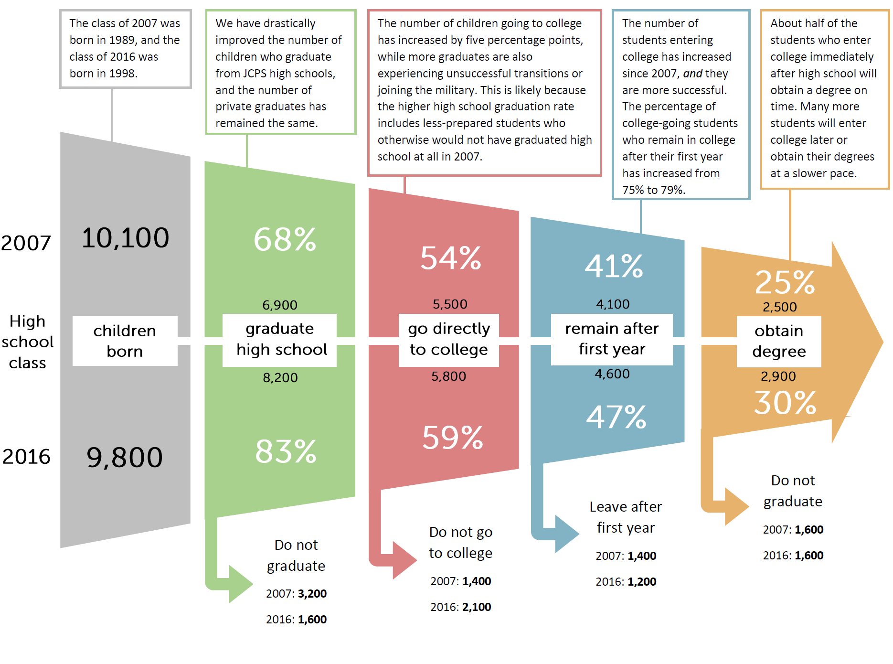

<div style="margin-top:50px;">
</div>

```{r "setup", include = FALSE}
knitr::opts_knit$set(root.dir = "C:/Users/Harrison Kirby/Desktop/GLP/ccu18")
knitr::opts_chunk$set(message = FALSE, warning = FALSE, echo = FALSE, fig.showtext=TRUE)
```

```{r libraries, cache = FALSE}
#Data
library(survey)
library(tidyverse)
library(magrittr)
library(feather)
library(labelled)

#Graphing
library(ggthemes)
library(classInt)
library(showtext)
library(reshape2)
library(rbokeh)
library(wesanderson)
library(kableExtra)
library(scales)

#Mapping
library(rgdal)
library(RColorBrewer)
library(leaflet)

#Make the dplyr select function the default over the plotly select function
select <- function(...){dplyr::select(...)}
```

```{r functions}
source('helper_functions.R')
```

```{r graphing, cache = FALSE}
source('graphing_functions.R')

font_add("Museo Sans 300", "MuseoSans_300.otf")
font_add("Museo Sans 300 Italic", "MuseoSans_300_Italic.otf")

#Tract Map
map_jc = readOGR('data/maps/tract', layer = "JC Tracts",
                 GDAL1_integer64_policy = TRUE, stringsAsFactors = FALSE, verbose = FALSE)

map_jc$TRACT <- as.numeric(map_jc$TRACT)

nh_names <- read_csv('data/maps/tract_to_nh.csv')

nh_names$Id2 <- substr(nh_names$Id2, 6, 13)
nh_names$Id2 <- as.numeric(nh_names$Id2)

map_jc@data <- full_join(map_jc@data, nh_names, by = c('TRACT' = 'Id2'))

map_jc@data$l_line1 <- paste("Tract #:", map_jc@data$TRACT, "in the")
map_jc@data$l_line2 <- paste(map_jc@data$Neighborhood, "neighborhood")

rm(nh_names)

#Zip Code map
map_jc_zip = readOGR('data/maps/zip', layer = 'Jefferson_County_KY_ZIP_Codes',
                     GDAL1_integer64_policy = TRUE, stringsAsFactors = FALSE, verbose = FALSE)

map_jc_zip$ZIPCODE <- as.numeric(map_jc_zip$ZIPCODE)

map_jc_zip@data$l_line1 <- paste0("Zip Code ", map_jc_zip@data$ZIPCODE)
```

```{r Website / output toggle}
web = TRUE
```

<div style="margin-top:50px;">
</div>

# MM: Bachelor's Degrees +
## 1. Ranking

```{r data1}
degree_df <- acs_time("/data/education/B15001/")

degree_df %<>%
  mutate(
    num_25_34 = 
      `Estimate; Male: - 25 to 34 years:` +
      `Estimate; Female: - 25 to 34 years:`,
    num_25_64 = 
      `Estimate; Male: - 25 to 34 years:` +
      `Estimate; Male: - 35 to 44 years:` +
      `Estimate; Male: - 45 to 64 years:` +
      `Estimate; Female: - 25 to 34 years:` +
      `Estimate; Female: - 35 to 44 years:` +
      `Estimate; Female: - 45 to 64 years:`,
    
    num_25_34_grad = 
      `Estimate; Male: - 25 to 34 years: - Graduate or professional degree` + 
      `Estimate; Female: - 25 to 34 years: - Graduate or professional degree`,
    
    num_25_64_grad = 
      `Estimate; Male: - 25 to 34 years: - Graduate or professional degree` +
      `Estimate; Male: - 35 to 44 years: - Graduate or professional degree` +
      `Estimate; Male: - 45 to 64 years: - Graduate or professional degree` +
      `Estimate; Female: - 25 to 34 years: - Graduate or professional degree` +
      `Estimate; Female: - 35 to 44 years: - Graduate or professional degree` +
      `Estimate; Female: - 45 to 64 years: - Graduate or professional degree`,
    
    num_25_34_bach_plus = 
      `Estimate; Male: - 25 to 34 years: - Bachelor's degree` + 
      `Estimate; Female: - 25 to 34 years: - Bachelor's degree` +
      num_25_34_grad,
    
    num_25_64_bach_plus = 
      `Estimate; Male: - 25 to 34 years: - Bachelor's degree` +
      `Estimate; Male: - 35 to 44 years: - Bachelor's degree` +
      `Estimate; Male: - 45 to 64 years: - Bachelor's degree` +
      `Estimate; Female: - 25 to 34 years: - Bachelor's degree` +
      `Estimate; Female: - 35 to 44 years: - Bachelor's degree` +
      `Estimate; Female: - 45 to 64 years: - Bachelor's degree` +
      num_25_64_grad,
    
    num_25_34_assoc_plus = 
      `Estimate; Male: - 25 to 34 years: - Associate's degree` +
      `Estimate; Female: - 25 to 34 years: - Associate's degree` +
      num_25_34_bach_plus,
    
    num_25_64_assoc_plus = 
      `Estimate; Male: - 25 to 34 years: - Associate's degree` +
      `Estimate; Male: - 35 to 44 years: - Associate's degree` +
      `Estimate; Male: - 45 to 64 years: - Associate's degree` +
      `Estimate; Female: - 25 to 34 years: - Associate's degree` +
      `Estimate; Female: - 35 to 44 years: - Associate's degree` +
      `Estimate; Female: - 45 to 64 years: - Associate's degree` +
      num_25_64_bach_plus,
    
    per_25_34_assoc_plus = num_25_34_assoc_plus / num_25_34 * 100,
    per_25_64_assoc_plus = num_25_64_assoc_plus / num_25_64 * 100,
    
    per_25_34_bach_plus = num_25_34_bach_plus / num_25_34 * 100,
    per_25_64_bach_plus = num_25_64_bach_plus / num_25_64 * 100,
    
    per_25_34_grad = num_25_34_grad / num_25_34 * 100,
    per_25_64_grad = num_25_64_grad / num_25_64 * 100) %>%
    {
      x <- .
      full_join(
        x %>% weight_stl(c('per_25_34_assoc_plus', 'per_25_34_bach_plus', 'per_25_34_grad'), 'num_25_34'),
        x %>% weight_stl(c('per_25_64_assoc_plus', 'per_25_64_bach_plus', 'per_25_64_grad'), 'num_25_64'))
    }

data <- degree_df

data %<>% pull_peers_FIPS() %>% select(FIPS, city, year, current, baseline, everything())

rm(degree_df)
```

```{r graph1}
rank_and_nb_group(data[data$year == 2017,], 
                  'per_25_64_bach_plus', 
                  plot_title = "Bachelor's Degrees or Higher, 2017",
                  subtitle_text = 'Ages 25-64')
```

## 2. Trendline {.tabset}
```{r data2}
#White
degree_white_05 <- acs_time("/data/education/B15002H/Y05/", starting_year = 2005)
degree_white_08 <- acs_time("/data/education/B15002H/Y08/", starting_year = 2008)

degree_white_05 <- degree_white_05 %>%
  mutate(
    total = `Estimate; Total:`,
    
    assoc_plus_per_white =
        (`Estimate; Female: - Associate's degree` +
        `Estimate; Male: - Associate's degree` +
        `Estimate; Female: - Bachelor's degree` + 
        `Estimate; Male: - Bachelor's degree` + 
        `Estimate; Female: - Graduate degree` + 
        `Estimate; Male: - Graduate degree`)
        / total * 100,
    
    bach_plus_per_white = 
        (`Estimate; Female: - Bachelor's degree` + 
        `Estimate; Male: - Bachelor's degree` + 
        `Estimate; Female: - Graduate degree` + 
        `Estimate; Male: - Graduate degree`)
        / total * 100) %>%
  select(FIPS, year, assoc_plus_per_white, bach_plus_per_white, total)

degree_white_08 <- degree_white_08 %>%
  mutate(
    total = `Estimate; Total:`,
    
    assoc_plus_per_white =
        (`Estimate; Female: - Associate's degree` +
        `Estimate; Male: - Associate's degree` +
        `Estimate; Female: - Bachelor's degree` + 
        `Estimate; Male: - Bachelor's degree` + 
        `Estimate; Female: - Graduate degree` + 
        `Estimate; Male: - Graduate degree`)
        / total * 100,
    
    bach_plus_per_white = 
        (`Estimate; Female: - Bachelor's degree` + 
        `Estimate; Male: - Bachelor's degree` + 
        `Estimate; Female: - Graduate degree` + 
        `Estimate; Male: - Graduate degree`)
         /total * 100) %>%
  select(FIPS, year, assoc_plus_per_white, bach_plus_per_white, total)

degree_white <- bind_rows(degree_white_05, degree_white_08) %>%
  weight_stl(c('assoc_plus_per_white', 'bach_plus_per_white'), 'total')

#Black
degree_black_05 = acs_time("/data/education/B15002B/Y05/", starting_year = 2005)
degree_black_08 = acs_time("/data/education/B15002B/Y08/", starting_year = 2008)

degree_black_05 %<>%
  mutate(
    total = `Estimate; Total:`,
    
    assoc_plus_per_black =
        (`Estimate; Female: - Associate's degree` +
        `Estimate; Male: - Associate's degree` +
        `Estimate; Female: - Bachelor's degree` + 
        `Estimate; Male: - Bachelor's degree` + 
        `Estimate; Female: - Graduate degree` + 
        `Estimate; Male: - Graduate degree`)
        / total * 100,
    
    bach_plus_per_black = 
        (`Estimate; Female: - Bachelor's degree` + 
        `Estimate; Male: - Bachelor's degree` + 
        `Estimate; Female: - Graduate degree` + 
        `Estimate; Male: - Graduate degree`)
        /total * 100) %>%
  select(FIPS, year, assoc_plus_per_black, bach_plus_per_black, total)

degree_black_08 %<>%
  mutate(
    total = `Estimate; Total:`,
    
    assoc_plus_per_black =
        (`Estimate; Female: - Associate's degree` +
        `Estimate; Male: - Associate's degree` +
        `Estimate; Female: - Bachelor's degree` + 
        `Estimate; Male: - Bachelor's degree` + 
        `Estimate; Female: - Graduate degree` + 
        `Estimate; Male: - Graduate degree`)
        / total * 100,
    
    bach_plus_per_black = 
        (`Estimate; Female: - Bachelor's degree` + 
        `Estimate; Male: - Bachelor's degree` + 
        `Estimate; Female: - Graduate degree` + 
        `Estimate; Male: - Graduate degree`)
        /total * 100) %>% 
  select(FIPS, year, assoc_plus_per_black, bach_plus_per_black, total)

degree_black = bind_rows(degree_black_05, degree_black_08) %>%
  weight_stl(c('assoc_plus_per_black', 'bach_plus_per_black'), 'total')

#Hispanic
degree_hispanic_05 = acs_time("/data/education/B15002I/Y05/", starting_year = 2005)
degree_hispanic_08 = acs_time("/data/education/B15002I/Y08/", starting_year = 2008)

degree_hispanic_05 = degree_hispanic_05 %>%
  mutate(
    total = `Estimate; Total:`,
    
    assoc_plus_per_hispanic =
        (`Estimate; Female: - Associate's degree` +
        `Estimate; Male: - Associate's degree` +
        `Estimate; Female: - Bachelor's degree` + 
        `Estimate; Male: - Bachelor's degree` + 
        `Estimate; Female: - Graduate degree` + 
        `Estimate; Male: - Graduate degree`)
        / total * 100,
    
    bach_plus_per_hispanic = 
      (`Estimate; Female: - Bachelor's degree` + 
       `Estimate; Male: - Bachelor's degree` + 
       `Estimate; Female: - Graduate degree` + 
       `Estimate; Male: - Graduate degree`)
      /total * 100) %>%
  select(FIPS, year, assoc_plus_per_hispanic, bach_plus_per_hispanic, total)

degree_hispanic_08 = degree_hispanic_08 %>%
  mutate(
    total = `Estimate; Total:`,
    
    assoc_plus_per_hispanic =
        (`Estimate; Female: - Associate's degree` +
        `Estimate; Male: - Associate's degree` +
        `Estimate; Female: - Bachelor's degree` + 
        `Estimate; Male: - Bachelor's degree` + 
        `Estimate; Female: - Graduate degree` + 
        `Estimate; Male: - Graduate degree`)
        / total * 100,
    
    bach_plus_per_hispanic = 
      (`Estimate; Female: - Bachelor's degree` + 
       `Estimate; Male: - Bachelor's degree` + 
       `Estimate; Female: - Graduate degree` + 
       `Estimate; Male: - Graduate degree`)
      /total * 100) %>%
  select(FIPS, year, assoc_plus_per_hispanic, bach_plus_per_hispanic, total)

degree_hispanic = bind_rows(degree_hispanic_05, degree_hispanic_08) %>%
  weight_stl(c('assoc_plus_per_hispanic', 'bach_plus_per_hispanic'), 'total')

data %<>% bind_df(degree_white, degree_black, degree_hispanic)

rm(degree_white_05, degree_white_08, degree_white, degree_black_05, degree_black_08, degree_black, degree_hispanic_05, degree_hispanic_08, degree_hispanic)
```

### 3-yr average

```{r}
graph_trendline(data,
                'per_25_64_bach_plus',
                plot_title = "Bachelor's Degrees, Ages 25-64",
                rollmean = 3,
                xmax = 2017)
```

### single-year

```{r graph2.1}
graph_trendline(data,
                'per_25_64_bach_plus',
                plot_title = "Bachelor's Degrees, Ages 25-64",
                xmax = 2017)
```

## 3. Map
```{r data3}
degree_map <- read_csv('Data/Education/ACS_16_5YR_B15001_with_ann.csv', skip = 1)

degree_map %<>%
  mutate(
    num_25_34 = 
      `Estimate; Male: - 25 to 34 years:` +
      `Estimate; Female: - 25 to 34 years:`,
    num_25_64 = 
      `Estimate; Male: - 25 to 34 years:` +
      `Estimate; Male: - 35 to 44 years:` +
      `Estimate; Male: - 45 to 64 years:` +
      `Estimate; Female: - 25 to 34 years:` +
      `Estimate; Female: - 35 to 44 years:` +
      `Estimate; Female: - 45 to 64 years:`,
    
    num_25_34_grad = 
      `Estimate; Male: - 25 to 34 years: - Graduate or professional degree` + 
      `Estimate; Female: - 25 to 34 years: - Graduate or professional degree`,
    
    num_25_64_grad = 
      `Estimate; Male: - 25 to 34 years: - Graduate or professional degree` +
      `Estimate; Male: - 35 to 44 years: - Graduate or professional degree` +
      `Estimate; Male: - 45 to 64 years: - Graduate or professional degree` +
      `Estimate; Female: - 25 to 34 years: - Graduate or professional degree` +
      `Estimate; Female: - 35 to 44 years: - Graduate or professional degree` +
      `Estimate; Female: - 45 to 64 years: - Graduate or professional degree`,
    
    num_25_34_bach_plus = 
      `Estimate; Male: - 25 to 34 years: - Bachelor's degree` + 
      `Estimate; Female: - 25 to 34 years: - Bachelor's degree` +
      num_25_34_grad,
    
    num_25_64_bach_plus = 
      `Estimate; Male: - 25 to 34 years: - Bachelor's degree` +
      `Estimate; Male: - 35 to 44 years: - Bachelor's degree` +
      `Estimate; Male: - 45 to 64 years: - Bachelor's degree` +
      `Estimate; Female: - 25 to 34 years: - Bachelor's degree` +
      `Estimate; Female: - 35 to 44 years: - Bachelor's degree` +
      `Estimate; Female: - 45 to 64 years: - Bachelor's degree` +
      num_25_64_grad,
    
    num_25_34_assoc_plus = 
      `Estimate; Male: - 25 to 34 years: - Associate's degree` +
      `Estimate; Female: - 25 to 34 years: - Associate's degree` +
      num_25_34_bach_plus,
    
    num_25_64_assoc_plus = 
      `Estimate; Male: - 25 to 34 years: - Associate's degree` +
      `Estimate; Male: - 35 to 44 years: - Associate's degree` +
      `Estimate; Male: - 45 to 64 years: - Associate's degree` +
      `Estimate; Female: - 25 to 34 years: - Associate's degree` +
      `Estimate; Female: - 35 to 44 years: - Associate's degree` +
      `Estimate; Female: - 45 to 64 years: - Associate's degree` +
      num_25_64_bach_plus) %>%
  transmute(
    Id = Id,
    
    per_25_34_assoc_plus = num_25_34_assoc_plus / num_25_34 * 100,
    per_25_64_assoc_plus = num_25_64_assoc_plus / num_25_64 * 100,
    
    per_25_34_bach_plus = num_25_34_bach_plus / num_25_34 * 100,
    per_25_64_bach_plus = num_25_64_bach_plus / num_25_64 * 100,
    
    per_25_34_grad = num_25_34_grad / num_25_34 * 100,
    per_25_64_grad = num_25_64_grad / num_25_64 * 100)

map_data <- degree_map
```

```{r map3}
map_jc@data<-full_join(map_jc@data, degree_map, by = c('GEO_ID' = 'Id'))

make_map("per_25_64_bach_plus", 
         name = "Bachelor's Degrees or Higher",
         legend_title = "Bachelor<br/>Degrees")

rm(degree_map)
```

## 4. By race {.tabset}

### 3-year average

```{r}
graph_trendline_race_peer(data,
                vars = c("bach_plus_per_white", "bach_plus_per_black", "bach_plus_per_hispanic"),
                "Bachelor's Degrees or Higher by Ethnicity",
                subtitle_text = 'Ages 25-64, ',
                rollmean = 3,
                xmax = 2017,
                y_title = "Percentage Points")
```

### single-year

```{r graph2.3}
graph_trendline_race_peer(data,
                vars = c("bach_plus_per_white", "bach_plus_per_black", "bach_plus_per_hispanic"),
                "Bachelor's Degrees or Higher by Ethnicity",
                subtitle_text = 'Ages 25-64, ',
                rollmean = 3,
                xmax = 2017,
                y_title = "Percentage Points")
```

```{r graph2.4, eval =FALSE}
graph_trendline_race_peer(data, 
                          vars = c('bach_plus_per_white', 'bach_plus_per_black', 'bach_plus_per_hispanic'),
                          plot_title = "Bachelor's Degrees by Ethnicity",
                          subtitle_text = 'Ages 25-64',
                          rollmean = 5)

graph_trendline_race_peer_two(data, 
                          vars = c('bach_plus_per_white', 'bach_plus_per_black'),
                          plot_title = "Bachelor's Degrees by Ethnicity",
                          subtitle_text = 'Ages 25-64',
                          rollmean = 5)


```

## 5. Peer Growth

```{r graph4}
graph_trendline_change(
  data,
  'per_25_64_bach_plus',
  plot_title = "Bachelor's Degrees, Ages 25 to 64",
  xmax = 2017)
```

-----------------

# Education Pipeline
## 1. Education Pipeline


# Young Adult Bachelor's Degrees

## 2. Ranking
```{r graph7.1}
rank_and_nb_group(data[data$year == 2017,],
                  'per_25_34_bach_plus',
                  plot_title = "Bachelor's Degrees or Higher, 2017",
                  subtitle_text = "Ages 25-34")
```

## 3. Trendline {.tabset}

### 3-year average
```{r}
graph_trendline(data,
                'per_25_34_bach_plus',
                plot_title = "Bachelor's Degrees or Higher, Ages 25-34",
                rollmean = 3,
                xmax = 2017)
```

### single-year
```{r}
graph_trendline(data,
                'per_25_34_bach_plus',
                plot_title = "Bachelor's Degrees or Higher, Ages 25-34",
                xmax = 2017)
```

## 4. Peer Growth
```{r}
graph_trendline_change(data,
                       'per_25_34_bach_plus',
                       plot_title = "Bachelor's Degrees or Higher, Ages 25-34, 2016",
                       xmax = 2017)
```

# Associate Degrees / Certificates

```{r cert, eval = FALSE}
certificates <- read_feather('data/education/certificates.feather')

certificates <- certificates[!duplicated(certificates$CPSIDP),]

this %<>%
  rename(MSA = METFIPS,
         year = YEAR) %>%
  pull_peers_MSA() %>%
  mutate(
    certification = if_else(PROFCERT == 2, 1, 0),
    certification = replace(certification, PROFCERT == 99, NA),
    degree = if_else(EDUC >= 91, 1, 0),
    cert_degree = if_else(certification == 1 | degree == 1, 1, 0),
    cert_no_degree = if_else(certification == 1 & degree == 0, 1, 0))
```

```{r}
certificates <- read_feather('data/education/processed_cert.feather')

certificates$city <- NA
certificates$city[certificates$METAREA == 3001] = "Grand Rapids"
certificates$city[certificates$METAREA == 7040] = "St. Louis"
certificates$city[certificates$METAREA == 5880] = "Oklahoma City"
certificates$city[certificates$METAREA == 8560] = "Tulsa"
certificates$city[certificates$METAREA == 3162] = "Greenville"
certificates$city[certificates$METAREA == 3840] = "Knoxville"
certificates$city[certificates$METAREA == 1001] = "Birmingham"
certificates$city[certificates$METAREA == 4520] = "Louisville"
certificates$city[certificates$METAREA == 3480] = "Indianapolis"
certificates$city[certificates$METAREA == 3760] = "Kansas City"
certificates$city[certificates$METAREA == 5921] = "Omaha"
certificates$city[certificates$METAREA == 3122] = "Greensboro"
certificates$city[certificates$METAREA == 1521] = "Charlotte"
certificates$city[certificates$METAREA == 1840] = "Columbus"
certificates$city[certificates$METAREA == 1641] = "Cincinnati"
certificates$city[certificates$METAREA == 5361] = "Nashville"
certificates$city[certificates$METAREA == 4920] = "Memphis"
certificates$city[certificates$METAREA == 3590] = "Jacksonville"
certificates$city[certificates$METAREA == 6642] = "Raleigh"
certificates$city[certificates$METAREA == 2002] = "Dayton"
certificates$city[certificates$METAREA == 6761] = "Richmond"

certificates %<>%
  filter(AGE > 24 & AGE < 65)

cert_svy <- svydesign(ids = ~1, weights = ~WTFINL, data = certificates)

cert_df <- svyby(~certification+cert_degree+cert_no_degree, ~city+year, design = cert_svy, svymean, na.rm = TRUE, na.rm.all = TRUE, drop.empty.groups = FALSE)%>%
  select(-se.certification, -se.cert_degree, -se.cert_no_degree) %>%
  mutate(certification = certification * 100,
         cert_degree = cert_degree * 100,
         cert_no_degree =cert_no_degree * 100,
         year = as.numeric(as.character(year)))

cert_df_degree <- svyby(~degree, ~city+year, design = cert_svy, svymean, na.rm = TRUE, na.rm.all = TRUE, drop.empty.groups = FALSE)%>%
  select(-se) %>%
  mutate(degree = degree * 100,
         year = as.numeric(as.character(year)))

cert_df <- full_join(cert_df, cert_df_degree, by = c('city', 'year'))


certificates_young <- certificates %<>%
  filter(AGE < 35)

cert_svy <- svydesign(ids = ~1, weights = ~WTFINL, data = certificates_young)

cert_df_young <- svyby(~certification+cert_degree+degree, ~city+year, design = cert_svy, svymean, na.rm = TRUE, na.rm.all = TRUE, drop.empty.groups = FALSE) %>%
  select(-se.certification, -se.cert_degree, -se.degree) %>%
  mutate(certification_young = certification * 100,
         cert_degree_young = cert_degree,
         year = as.numeric(as.character(year)))

cert_df_lou =  svyby(~certification, ~year, design = subset(cert_svy, COUNTY == 21111), svymean, na.rm = TRUE, na.rm.all = TRUE, drop.empty.groups = FALSE) 

names <- read_csv('data/MSA to FIPS.csv') %>% select(-MSA)

cert_df %<>% left_join(names) %>% select(-city)
cert_df_young %<>% left_join(names) %>% select(-city, -certification, -cert_degree)


data %<>% 
  select(-city, -baseline, - current) %>%
  full_join(cert_df, by = c('FIPS', 'year')) %>%
  pull_peers_FIPS()

```

## 5. Certificate Ranking

```{r graphcert1}
rank_and_nb_group(data[data$year == 2017,], 
                  'cert_no_degree', 
                  plot_title = 'Certificates as highest credential, 2017',
                  subtitle_text = 'Ages 25-64')
```

## 6. Associate Degree Trendline {.tabset}

### 3-year average
```{r}
graph_trendline(data,
                'per_25_64_assoc_plus',
                plot_title = "Associate Degrees, Ages 25-64",
                rollmean = 3,
                xmax = 2017)
```

### single-year
```{r}
graph_trendline(data,
                'per_25_64_assoc_plus',
                plot_title = "Associate Degrees, Ages 25-64",
                xmax = 2017)
```