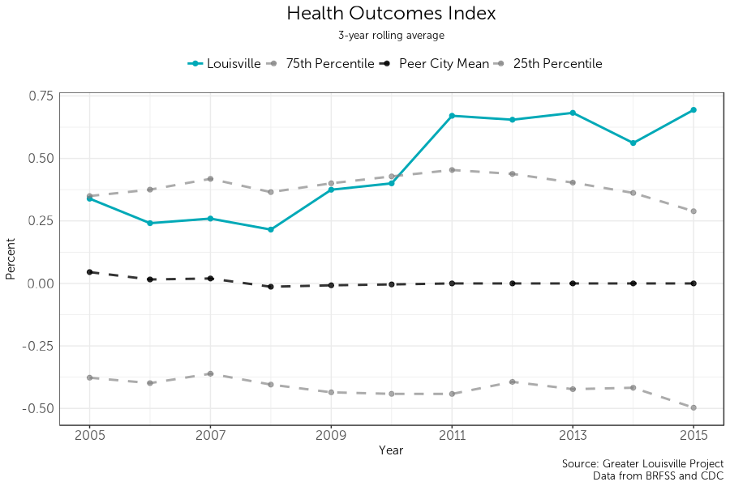
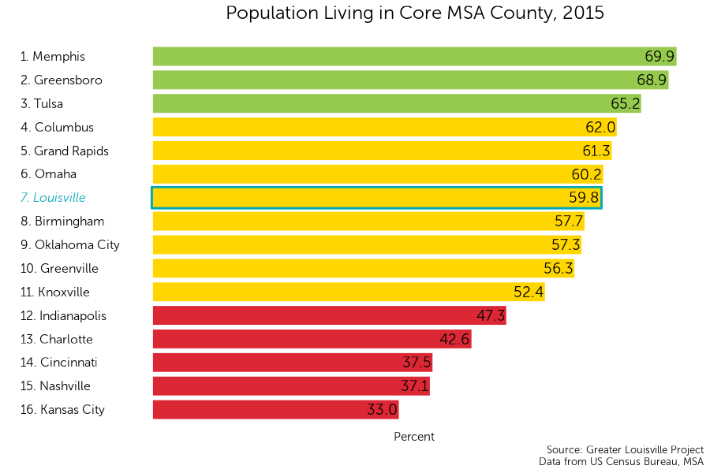

<div style="margin-top:50px;">
</div>

```{r "setup", include = FALSE}
knitr::opts_knit$set(root.dir = "C:/Users/Harrison Kirby/Desktop/GLP/ccu18")
knitr::opts_chunk$set(message = FALSE, warning = FALSE, echo = FALSE, fig.showtext=TRUE)
```

```{r libraries}
#Data
library(survey)
library(tidyverse)
library(magrittr)
library(feather)
library(labelled)

#Graphing
library(ggthemes)
library(classInt)
library(showtext)
library(reshape2)
library(rbokeh)
library(wesanderson)
library(kableExtra)
library(scales)

#Mapping
library(rgdal)
library(RColorBrewer)
library(leaflet)

#Make the dplyr select function the default over the plotly select function
select <- function(...){dplyr::select(...)}
```

```{r functions}
source('helper_functions.R')
```

```{r graphing}
source('graphing_functions.R')

font_add("Museo Sans 300", "MuseoSans_300.otf")
font_add("Museo Sans 300 Italic", "MuseoSans_300_Italic.otf")

#Tract Map
map_jc = readOGR('data/maps/tract', layer = "JC Tracts",
                 GDAL1_integer64_policy = TRUE, stringsAsFactors = FALSE, verbose = FALSE)

map_jc$TRACT <- as.numeric(map_jc$TRACT)

nh_names <- read_csv('data/maps/tract_to_nh.csv')

nh_names$Id2 <- substr(nh_names$Id2, 6, 13)
nh_names$Id2 <- as.numeric(nh_names$Id2)

map_jc@data <- full_join(map_jc@data, nh_names, by = c('TRACT' = 'Id2'))

map_jc@data$l_line1 <- paste("Tract #:", map_jc@data$TRACT, "in the")
map_jc@data$l_line2 <- paste(map_jc@data$Neighborhood, "neighborhood")

rm(nh_names)

#Zip Code map
map_jc_zip = readOGR('data/maps/zip', layer = 'Jefferson_County_KY_ZIP_Codes',
                     GDAL1_integer64_policy = TRUE, stringsAsFactors = FALSE, verbose = FALSE)

map_jc_zip$ZIPCODE <- as.numeric(map_jc_zip$ZIPCODE)

map_jc_zip@data$l_line1 <- paste0("Zip Code ", map_jc_zip@data$ZIPCODE)
```

```{r Website / output toggle}
web = TRUE
```

<div style="margin-top:50px;">
</div>

# Education

## Ranking

```{r data1}
degree_df <- acs_time("/data/education/B15001/")

degree_df %<>%
  mutate(
    num_25_34 = 
      `Estimate; Male: - 25 to 34 years:` +
      `Estimate; Female: - 25 to 34 years:`,
    num_25_64 = 
      `Estimate; Male: - 25 to 34 years:` +
      `Estimate; Male: - 35 to 44 years:` +
      `Estimate; Male: - 45 to 64 years:` +
      `Estimate; Female: - 25 to 34 years:` +
      `Estimate; Female: - 35 to 44 years:` +
      `Estimate; Female: - 45 to 64 years:`,
    
    num_25_34_grad = 
      `Estimate; Male: - 25 to 34 years: - Graduate or professional degree` + 
      `Estimate; Female: - 25 to 34 years: - Graduate or professional degree`,
    
    num_25_64_grad = 
      `Estimate; Male: - 25 to 34 years: - Graduate or professional degree` +
      `Estimate; Male: - 35 to 44 years: - Graduate or professional degree` +
      `Estimate; Male: - 45 to 64 years: - Graduate or professional degree` +
      `Estimate; Female: - 25 to 34 years: - Graduate or professional degree` +
      `Estimate; Female: - 35 to 44 years: - Graduate or professional degree` +
      `Estimate; Female: - 45 to 64 years: - Graduate or professional degree`,
    
    num_25_34_bach_plus = 
      `Estimate; Male: - 25 to 34 years: - Bachelor's degree` + 
      `Estimate; Female: - 25 to 34 years: - Bachelor's degree` +
      num_25_34_grad,
    
    num_25_64_bach_plus = 
      `Estimate; Male: - 25 to 34 years: - Bachelor's degree` +
      `Estimate; Male: - 35 to 44 years: - Bachelor's degree` +
      `Estimate; Male: - 45 to 64 years: - Bachelor's degree` +
      `Estimate; Female: - 25 to 34 years: - Bachelor's degree` +
      `Estimate; Female: - 35 to 44 years: - Bachelor's degree` +
      `Estimate; Female: - 45 to 64 years: - Bachelor's degree` +
      num_25_64_grad,
    
    num_25_34_assoc_plus = 
      `Estimate; Male: - 25 to 34 years: - Associate's degree` +
      `Estimate; Female: - 25 to 34 years: - Associate's degree` +
      num_25_34_bach_plus,
    
    num_25_64_assoc_plus = 
      `Estimate; Male: - 25 to 34 years: - Associate's degree` +
      `Estimate; Male: - 35 to 44 years: - Associate's degree` +
      `Estimate; Male: - 45 to 64 years: - Associate's degree` +
      `Estimate; Female: - 25 to 34 years: - Associate's degree` +
      `Estimate; Female: - 35 to 44 years: - Associate's degree` +
      `Estimate; Female: - 45 to 64 years: - Associate's degree` +
      num_25_64_bach_plus,
    
    per_25_34_assoc_plus = num_25_34_assoc_plus / num_25_34 * 100,
    per_25_64_assoc_plus = num_25_64_assoc_plus / num_25_64 * 100,
    
    per_25_34_bach_plus = num_25_34_bach_plus / num_25_34 * 100,
    per_25_64_bach_plus = num_25_64_bach_plus / num_25_64 * 100,
    
    per_25_34_grad = num_25_34_grad / num_25_34 * 100,
    per_25_64_grad = num_25_64_grad / num_25_64 * 100) %>%
    {
      x <- .
      full_join(
        x %>% weight_stl(c('per_25_34_assoc_plus', 'per_25_34_bach_plus', 'per_25_34_grad'), 'num_25_34'),
        x %>% weight_stl(c('per_25_64_assoc_plus', 'per_25_64_bach_plus', 'per_25_64_grad'), 'num_25_64'))
    }

data <- degree_df

data %<>% pull_peers_FIPS() %>% select(FIPS, city, year, current, baseline, everything())

rm(degree_df)
```

```{r graph1}
rank_and_nb_group(data[data$year == 2016,], 
                  'per_25_64_bach_plus', 
                  plot_title = 'Bachelor Degrees or Higher, 2016',
                  subtitle_text = 'Ages 25-64')
```

## Trendline {.tabset}

### Three-year
```{r graph2.1}
graph_trendline(data,
                'per_25_64_bach_plus',
                plot_title = 'Bachelor Degrees, Ages 25-64',
                rollmean = 3)
```

### One-year

```{r graph2.2}
graph_trendline(data,
                'per_25_64_bach_plus',
                plot_title = 'Bachelor Degrees, Ages 25-64')
```

## Map
```{r data3}
degree_map <- read_csv('Data/Education/ACS_16_5YR_B15001_with_ann.csv', skip = 1)

degree_map %<>%
  mutate(
    num_25_34 = 
      `Estimate; Male: - 25 to 34 years:` +
      `Estimate; Female: - 25 to 34 years:`,
    num_25_64 = 
      `Estimate; Male: - 25 to 34 years:` +
      `Estimate; Male: - 35 to 44 years:` +
      `Estimate; Male: - 45 to 64 years:` +
      `Estimate; Female: - 25 to 34 years:` +
      `Estimate; Female: - 35 to 44 years:` +
      `Estimate; Female: - 45 to 64 years:`,
    
    num_25_34_grad = 
      `Estimate; Male: - 25 to 34 years: - Graduate or professional degree` + 
      `Estimate; Female: - 25 to 34 years: - Graduate or professional degree`,
    
    num_25_64_grad = 
      `Estimate; Male: - 25 to 34 years: - Graduate or professional degree` +
      `Estimate; Male: - 35 to 44 years: - Graduate or professional degree` +
      `Estimate; Male: - 45 to 64 years: - Graduate or professional degree` +
      `Estimate; Female: - 25 to 34 years: - Graduate or professional degree` +
      `Estimate; Female: - 35 to 44 years: - Graduate or professional degree` +
      `Estimate; Female: - 45 to 64 years: - Graduate or professional degree`,
    
    num_25_34_bach_plus = 
      `Estimate; Male: - 25 to 34 years: - Bachelor's degree` + 
      `Estimate; Female: - 25 to 34 years: - Bachelor's degree` +
      num_25_34_grad,
    
    num_25_64_bach_plus = 
      `Estimate; Male: - 25 to 34 years: - Bachelor's degree` +
      `Estimate; Male: - 35 to 44 years: - Bachelor's degree` +
      `Estimate; Male: - 45 to 64 years: - Bachelor's degree` +
      `Estimate; Female: - 25 to 34 years: - Bachelor's degree` +
      `Estimate; Female: - 35 to 44 years: - Bachelor's degree` +
      `Estimate; Female: - 45 to 64 years: - Bachelor's degree` +
      num_25_64_grad,
    
    num_25_34_assoc_plus = 
      `Estimate; Male: - 25 to 34 years: - Associate's degree` +
      `Estimate; Female: - 25 to 34 years: - Associate's degree` +
      num_25_34_bach_plus,
    
    num_25_64_assoc_plus = 
      `Estimate; Male: - 25 to 34 years: - Associate's degree` +
      `Estimate; Male: - 35 to 44 years: - Associate's degree` +
      `Estimate; Male: - 45 to 64 years: - Associate's degree` +
      `Estimate; Female: - 25 to 34 years: - Associate's degree` +
      `Estimate; Female: - 35 to 44 years: - Associate's degree` +
      `Estimate; Female: - 45 to 64 years: - Associate's degree` +
      num_25_64_bach_plus) %>%
  transmute(
    Id = Id,
    
    per_25_34_assoc_plus = num_25_34_assoc_plus / num_25_34 * 100,
    per_25_64_assoc_plus = num_25_64_assoc_plus / num_25_64 * 100,
    
    per_25_34_bach_plus = num_25_34_bach_plus / num_25_34 * 100,
    per_25_64_bach_plus = num_25_64_bach_plus / num_25_64 * 100,
    
    per_25_34_grad = num_25_34_grad / num_25_34 * 100,
    per_25_64_grad = num_25_64_grad / num_25_64 * 100)

map_data <- degree_map
```

```{r map3}
map_jc@data<-full_join(map_jc@data, degree_map, by = c('GEO_ID' = 'Id'))

make_map("per_25_64_bach_plus", 
         name = "Bachelor Degrees or Higher",
         legend_title = "Bachelor<br/>Degrees")

rm(degree_map)
```

## Peer Highlight
```{r graph4}
graph_trendline_change(data,
                'per_25_64_bach_plus',
                plot_title = 'Bachelor Degrees, Ages 25 to 64')

```

# Education: Young Adults

## Ranking
```{r graph7.1}
rank_and_nb_group(data[data$year == 2016,],
                  'per_25_34_bach_plus',
                  plot_title = 'Bachelor Degrees or Higher, Ages 25-34')
                  

```

## Trendline {.tabset}

### Three-year
```{r graph7.2}
graph_trendline(data,
                'per_25_34_bach_plus',
                plot_title = 'Bachelor Degrees or Higher, Ages 25-34, 2016',
                rollmean = 3)
```

### One-year
```{r graph7.23}
graph_trendline(data,
                'per_25_34_bach_plus',
                plot_title = 'Bachelor Degrees or Higher, Ages 25-34, 2016')
```

## Map
```{r map7}
make_map("per_25_34_bach_plus", 
         name = "Bachelor Degrees or Higher",
         legend_title = "Bachelor<br/>Degrees")

rm(degree_map)
```

## Peer Highlight
```{r graph44}
graph_trendline_change(data,
                'per_25_34_bach_plus',
                plot_title = 'Bachelor Degrees, Ages 25 to 34')

```

# Jobs

## Ranking

```{r data9}
earn_data <- acs_time("/data/jobs/S2001/")

earn_data <- earn_data %>%
  select(FIPS, 
         year,
         median_earnings = `Total; Estimate; Population 16 years and over with earnings - Median earnings (dollars)`) %>%
  mutate(median_earnings = as.numeric(as.character(median_earnings)),
         FIPS = as.character(FIPS)) %>%
  weight_stl('median_earnings')

data <- earn_data

data %<>% pull_peers_FIPS() %>% select(FIPS, city, year, current, baseline, everything())

rm(earn_data)
```

```{r}
rpp <- read_csv("data/jobs/rppmsa.csv", skip = 4, col_names = TRUE, na = c("", "(NA)"))

rpp$`2005` <- rpp$`2008`
rpp$`2006` <- rpp$`2008`
rpp$`2007` <- rpp$`2008`
rpp$`2016` <- rpp$`2015`

rpp <- rpp %>%
  filter(LineCode == 4) %>%
  select(-GeoFips, -LineCode, -Description) %>%
  gather(2:13, key = year, value = "rpp") %>%
  mutate(year = as.numeric(year))

rpp$MSA <- substr(rpp$GeoName, 0, unlist(gregexpr(pattern = " \\(", rpp$GeoName)) -1 )

rpp$MSA[rpp$MSA == "Grand Rapids-Wyoming, MI"] = "Grand Rapids"
rpp$MSA[rpp$MSA == "St. Louis, MO-IL"] = "St. Louis"
rpp$MSA[rpp$MSA == "Oklahoma City, OK"] = "Oklahoma City"
rpp$MSA[rpp$MSA == "Tulsa, OK"] = "Tulsa"
rpp$MSA[rpp$MSA == "Greenville-Anderson-Mauldin, SC"] = "Greenville"
rpp$MSA[rpp$MSA == "Knoxville, TN"] = "Knoxville"
rpp$MSA[rpp$MSA == "Birmingham-Hoover, AL"] = "Birmingham"
rpp$MSA[rpp$MSA == "Louisville/Jefferson County, KY-IN"] = "Louisville"
rpp$MSA[rpp$MSA == "Indianapolis-Carmel-Anderson, IN"] = "Indianapolis"
rpp$MSA[rpp$MSA == "Kansas City, MO-KS"] = "Kansas City"
rpp$MSA[rpp$MSA == "Omaha-Council Bluffs, NE-IA"] = "Omaha"
rpp$MSA[rpp$MSA == "Greensboro-High Point, NC"] = "Greensboro"
rpp$MSA[rpp$MSA == "Charlotte-Concord-Gastonia, NC-SC"] = "Charlotte"
rpp$MSA[rpp$MSA == "Columbus, OH"] = "Columbus"
rpp$MSA[rpp$MSA == "Cincinnati, OH-KY-IN"] = "Cincinnati"
rpp$MSA[rpp$MSA == "Nashville-Davidson--Murfreesboro--Franklin, TN"] = "Nashville"
rpp$MSA[rpp$MSA == "Memphis, TN-MS-AR"] = "Memphis"
rpp$MSA[rpp$MSA == "Jacksonville, FL"] = "Jacksonville"
rpp$MSA[rpp$MSA == "Raleigh, NC"] = "Raleigh"
rpp$MSA[rpp$MSA == "Dayton, OH"] = "Dayton"
rpp$MSA[rpp$MSA == "Richmond, VA"] = "Richmond"

rpp %<>% select(-GeoName)

data %<>% left_join(rpp, by = c('year' = 'year', 'city' = 'MSA'))

data %<>%
  group_by(year) %>%
  mutate(rpp_lou = rpp[city == "Louisville"],
         rpp_index = rpp_lou / rpp) %>%
  ungroup() %>%
  select(-rpp, -rpp_lou)

cpi <- read_csv("data/jobs/CPI-U-RS.csv")

cpi %<>%
  rename(year = YEAR,
         cpi = AVG)

data %<>% left_join(cpi, by = "year")

data %<>%
  group_by(city) %>%
  mutate(base_cpi = cpi[year == 2016],
         cpi_index = base_cpi/cpi) %>%
  ungroup() %>%
  select(-cpi, -base_cpi)

data %<>% mutate(median_earnings = median_earnings * rpp_index * cpi_index)

rm(rpp, cpi)
```

```{r graph9}
rank_and_nb_group(data[data$year == 2016,], 
                  'median_earnings', 
                  plot_title = 'Median Earnings, 2016')
```

## Trendline

```{r graph 10.1}
graph_trendline(data,
                'median_earnings',
                plot_title = 'Median Earnings',
                y_title = 'Dollars')
```

## Map
```{r data11}
earn_map <- read_csv("data/jobs/ACS_16_5YR_S2001_with_ann.csv", skip = 1,
                      col_types = cols(
                      `Total; Estimate; Median earnings (dollars)` = col_number())
                   ) 

earn_map %<>% select(Id, median_earnings = `Total; Estimate; Median earnings (dollars)`)
```

```{r graph11}
map_jc@data <- full_join(map_jc@data, earn_map, by = c('GEO_ID' = 'Id'))

make_map("median_earnings", 
         name = "Median Earnings",
         legend_title = "Median<br/>Earnings",
         units = "Dollars")

rm(earn_map)
```

## Peer Highlight
```{r graph54}
graph_trendline_change(data,
                'median_earnings',
                plot_title = 'Median Earnings')

```

# Health

## Ranking


## Trendline {.tabset}




## Map


# Quality of Place

## Ranking


## Trendline


## Peer Highlight
```{r graph49}
qop <- read_csv('C:/Users/Harrison Kirby/Desktop/GLP/glp_website/output data/qp_data_fips.csv') %>% mutate(FIPS = as.character(FIPS)) %>% left_join(names)

graph_trendline_change(qop,
                'pct_pop_core_county',
                oldest_year = 2010,
                newest_year = 2015,
                xmin = 2010,
                xmax = 2015,
                plot_title = 'Health Outcomes')

```

# Other fun new data

## Commute Time
```{r data31}
commute_time <- read_csv('data/qop/ACS_16_5YR_B08013_with_ann.csv', skip = 1)

commute_num <- read_csv('data/qop/ACS_16_5YR_B08012_with_ann.csv', skip = 1)

commute <- full_join(commute_time, commute_num)

commute %<>%
    mutate(time = as.numeric(`Estimate; Aggregate travel time to work (in minutes):`),
           number = `Estimate; Total:`,
           commute = time / number) %>%
  select(Id, commute)
```

```{r graph31}
map_jc@data <- full_join(map_jc@data, commute, by = c('GEO_ID' = 'Id'))

make_map("commute", 
         name = "Commute Time",
         legend_title = "Commute Time",
         units = "minutes")
```

## Certificates {.tabset}

```{r cert}
certificates <- read_feather('data/education/certificates.feather')

certificates <- certificates[!duplicated(certificates$CPSIDP),]

certificates %<>%
  rename(MSA = METFIPS,
         year = YEAR) %>%
  pull_peers_MSA() %>%
  mutate(
    certification = if_else(PROFCERT == 2, 1, 0),
    certification = replace(certification, PROFCERT == 99, NA),
    degree = if_else(EDUC >= 91, 1, 0),
    cert_degree = if_else(certification == 1 | degree == 1, 1, 0),
    cert_no_degree = if_else(certification == 1 & degree == 0, 1, 0))

certificates$city <- NA
certificates$city[certificates$METAREA == 3001] = "Grand Rapids"
certificates$city[certificates$METAREA == 7040] = "St. Louis"
certificates$city[certificates$METAREA == 5880] = "Oklahoma City"
certificates$city[certificates$METAREA == 8560] = "Tulsa"
certificates$city[certificates$METAREA == 3162] = "Greenville"
certificates$city[certificates$METAREA == 3840] = "Knoxville"
certificates$city[certificates$METAREA == 1001] = "Birmingham"
certificates$city[certificates$METAREA == 4520] = "Louisville"
certificates$city[certificates$METAREA == 3480] = "Indianapolis"
certificates$city[certificates$METAREA == 3760] = "Kansas City"
certificates$city[certificates$METAREA == 5921] = "Omaha"
certificates$city[certificates$METAREA == 3122] = "Greensboro"
certificates$city[certificates$METAREA == 1521] = "Charlotte"
certificates$city[certificates$METAREA == 1840] = "Columbus"
certificates$city[certificates$METAREA == 1641] = "Cincinnati"
certificates$city[certificates$METAREA == 5361] = "Nashville"
certificates$city[certificates$METAREA == 4920] = "Memphis"
certificates$city[certificates$METAREA == 3590] = "Jacksonville"
certificates$city[certificates$METAREA == 6642] = "Raleigh"
certificates$city[certificates$METAREA == 2002] = "Dayton"
certificates$city[certificates$METAREA == 6761] = "Richmond"

certificates %<>%
  filter(AGE > 24 & AGE < 65)

cert_svy <- svydesign(ids = ~1, weights = ~WTFINL, data = certificates)

cert_df <- svyby(~certification+cert_degree+cert_no_degree, ~city+year, design = cert_svy, svymean, na.rm = TRUE) %>%
  select(-se.certification, -se.cert_degree, -se.cert_no_degree) %>%
  mutate(certification = certification * 100,
         cert_degree = cert_degree * 100,
         cert_no_degree =cert_no_degree * 100)

certificates_young <- certificates %<>%
  filter(AGE < 35)

cert_svy <- svydesign(ids = ~1, weights = ~WTFINL, data = certificates_young)

cert_df_young <- svyby(~certification+cert_degree, ~city+year, design = cert_svy, svymean, na.rm = TRUE) %>%
  select(-se.certification, -se.cert_degree) %>%
  mutate(certification_young = certification * 100,
         cert_degree_young = cert_degree * 100)

cert_df_lou =  svyby(~certification, ~year, design = subset(cert_svy, COUNTY == 21111), svymean, na.rm = TRUE) 

names <- read_csv('data/MSA to FIPS.csv') %>% select(-MSA)

cert_df %<>% left_join(names) %>% select(-city)
cert_df_young %<>% left_join(names) %>% select(-city, -certification, -cert_degree)


data %<>% 
  select(-city, -baseline, - current) %>%
  full_join(cert_df, by = c('FIPS', 'year')) %>%
  pull_peers_FIPS()

```


### Certificates

```{r graphcert1}
rank_and_nb_group(data[data$year == 2017,], 
                  'certification', 
                  plot_title = 'Certificates, 2017',
                  subtitle_text = 'Ages 25-64')

rank_and_nb_group(data[data$year == 2017,], 
                  'cert_no_degree', 
                  plot_title = 'Certification and No Degree, 2017',
                  subtitle_text = 'Ages 25-64')

rank_and_nb_group(data[data$year == 2017,], 
                  'cert_degree', 
                  plot_title = 'Certification or Degree, 2017',
                  subtitle_text = 'Ages 25-64')
```

### Trendlines

```{r graphcert2}
graph_trendline(data,
                'certification',
                plot_title = 'Certifications',
                xmin = 2015,
                xmax = 2017)

graph_trendline(data,
                'cert_no_degree',
                plot_title = 'Certification and no Degree',
                xmin = 2015,
                xmax = 2017)

graph_trendline(data,
                'cert_degree',
                plot_title = 'Certification or Degree',
                xmin = 2015,
                xmax = 2017)
```

```{r, eval =FALSE}
### Ranking - Young

rank_and_nb_group(data[data$year == 2017,], 
                  'certification_young', 
                  plot_title = 'Certificates, 2017',
                  subtitle_text = 'Ages 25-34')

rank_and_nb_group(data[data$year == 2017,], 
                  'cert_degree_young', 
                  plot_title = 'Certification or Degree, 2017',
                  subtitle_text = 'Ages 25-34')


### Trendline - Young


graph_trendline(data,
                'certification_young',
                plot_title = 'Certifications',
                xmin = 2015,
                xmax = 2018)

graph_trendline(data,
                'cert_degree_young',
                plot_title = 'Certification or Degree',
                xmin = 2015,
                xmax = 2018)
```
