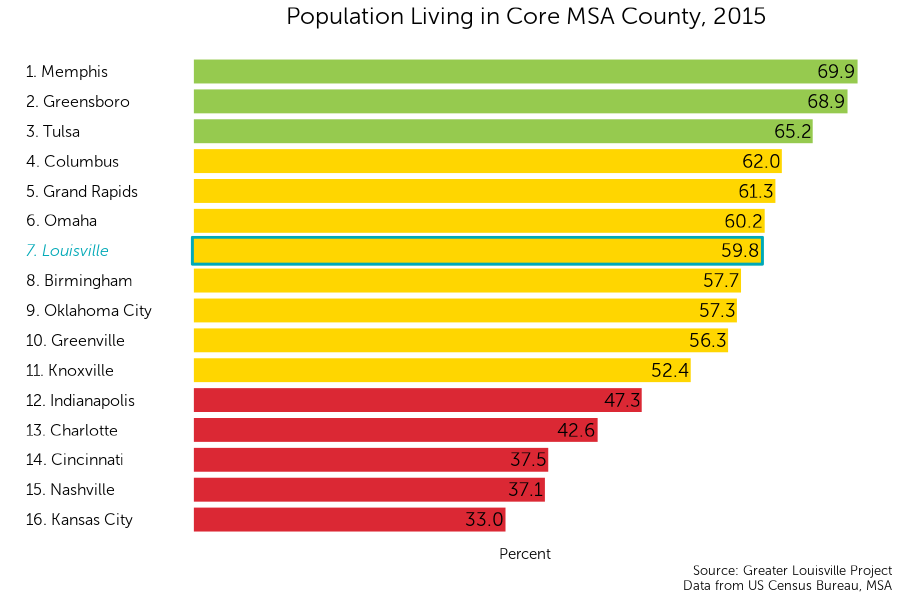
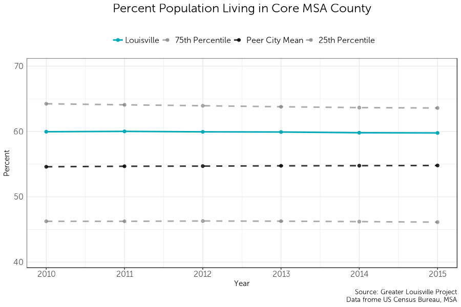
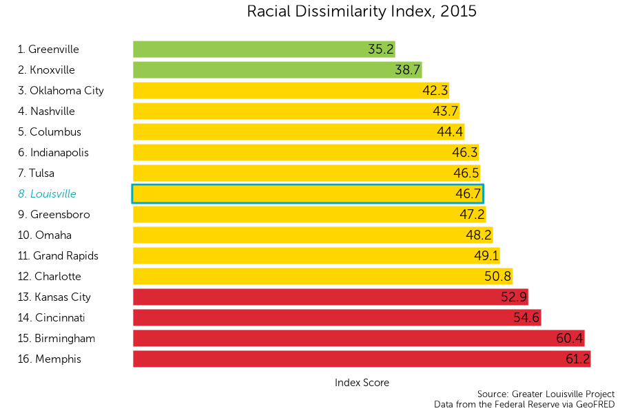
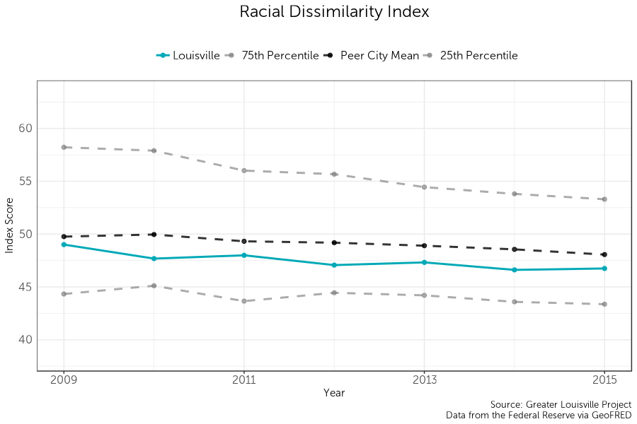

<div style="margin-top:50px;">
</div>
```{r "setup", include = FALSE}
knitr::opts_knit$set(root.dir = "C:/Users/Harrison Kirby/Desktop/GLP/ccu18")
knitr::opts_chunk$set(message = FALSE, warning = FALSE, echo = FALSE, fig.showtext=TRUE)
```

```{r libraries}
#Data
library(glptools)
library(survey)
library(tidyverse)
library(magrittr)
library(feather)
library(labelled)

#Graphing
library(ggthemes)
library(classInt)
library(showtext)
library(reshape2)
library(rbokeh)
library(wesanderson)
library(kableExtra)
library(scales)

#Mapping
library(rgdal)
library(RColorBrewer)
library(leaflet)

#Make the dplyr select function the default over the plotly select function
select <- function(...){dplyr::select(...)}
```

```{r graphingqop}
font_add("Museo Sans 300", "MuseoSans_300.otf")
font_add("Museo Sans 300 Italic", "MuseoSans_300_Italic.otf")

#Tract Map
map_tract = readOGR('data/maps/tract', layer = "tract",
                 GDAL1_integer64_policy = TRUE, stringsAsFactors = FALSE, verbose = FALSE)

map_tract$TRACT <- as.numeric(map_tract$TRACT)

nh_names <- read_csv('data/maps/tract_to_nh.csv')

nh_names$Id2 <- substr(nh_names$Id2, 6, 13)
nh_names$Id2 <- as.numeric(nh_names$Id2)

map_tract@data <- full_join(map_tract@data, nh_names, by = c('TRACT' = 'Id2'))

map_tract@data$l_line1 <- paste("Tract #:", map_tract@data$TRACT, "in the")
map_tract@data$l_line2 <- paste(map_tract@data$Neighborhood, "neighborhood")

rm(nh_names)

#Zip Code map
map_zip = readOGR('data/maps/zip', layer = 'Jefferson_County_KY_ZIP_Codes',
                     GDAL1_integer64_policy = TRUE, stringsAsFactors = FALSE, verbose = FALSE)

map_zip$ZIPCODE <- as.numeric(map_zip$ZIPCODE)

map_zip@data$l_line1 <- paste0("Zip Code ", map_zip@data$ZIPCODE)
```

```{r Website / output toggle}
web = TRUE
```

```{r ISP, eval = FALSE}
map_jc_block = readOGR('data/maps/block', layer = "tl_2017_21_tabblock10",
                 GDAL1_integer64_policy = TRUE, stringsAsFactors = FALSE, verbose = FALSE)

map_jc_block$block <- as.numeric(map_jc_block$GEOID10)

map_jc_block@data$l_line1 <- paste0("Block ", map_jc_block@data$block)

internet <- read_csv("data/qop/KY-Fixed-Dec2016-v1.csv")

data <- internet %>% 
  rename(block = BlockCode) %>%
  filter(Consumer == 1) %>%
  group_by(block) %>%
  summarise(maxup = max(MaxAdUp),
            maxdown = max(MaxAdDown))

map_jc_block@data <- left_join(map_jc_block@data, data)

make_map_block("maxdown", 
               name = "Internet",
               legend_title = "Internet",
               units = "none")
```

# MM: Population in Core County
```{r data26, eval=FALSE}
#Read in core county population data
fips_core_county_pop <- read_csv("data/population_data_one_stl.csv")
  
#Create "key" for core FIPS county to MSA
msa_fips_key <- read_csv("data/msa_to_fips.csv")

msa_fips_key %<>% 
  mutate(FIPS = as.character(FIPS)) %>%
  pull_peers_FIPS()

msa_fips_key$FIPS[msa_fips_key$MSA == 41180]<- "MERGED"

#Add MSA code
fips_core_county_pop %<>% left_join(msa_fips_key, by = "FIPS")
fips_core_county_pop %<>% filter(year >= 2010)

#Tidy MSA Population estimate Data
msa_pop_est <- read_csv("data/qop/cbsa-est2016-alldata.csv", n_max = 1581)
msa_pop_est %<>% filter(LSAD == "Metropolitan Statistical Area") %>%
  mutate(MSA = CBSA) %>%
  pull_peers_MSA() %>%
  select(MSA, POPESTIMATE2010:POPESTIMATE2015) %>%
  gather(POPESTIMATE2010:POPESTIMATE2015, key = 'year',value = population_estimate)

msa_pop_est$year = substr(msa_pop_est$year, 12,15)
msa_pop_est$year = as.numeric(msa_pop_est$year)

#Combine datasets and create core county pct estimates
fips_core_county_pop %<>% left_join(msa_pop_est, by = c("MSA", "year"))

fips_core_county_pop %<>% 
  mutate(pct_pop_core_county = 100 * population / population_estimate) %>%
  rename(core_county_pop = population,
         msa_population_estimate = population_estimate) %>%
  select(FIPS, year, pct_pop_core_county)

data %<>% bind_df(fips_core_county_pop)

rm(fips_core_county_pop, msa_fips_key, msa_pop_est)
```

## 1. Ranking

```{r graph26, eval = FALSE}
rank_and_nb_group(data[data$year == 2015,],
                  'pct_pop_core_county',
                  plot_title = 'Percent of the population living in the Core County')
```

## 2. Trendline

```{r graph 26.1, eval = FALSE}
graph_trendline(data,
                'pct_pop_core_county',
                plot_title = 'Percent of the population living in the Core County',
                xmin = 2010,
                xmax = 2015)
```

map_jc_00 = readOGR('data/maps/tract2000', layer = "tr21_d00",
                 GDAL1_integer64_policy = TRUE, stringsAsFactors = FALSE, verbose = FALSE)

map_jc_00$TRACT <- as.numeric(map_jc_00$TRACT)

```{r popdata1}
#Tract Map
pop_00 <- read_csv('data/qop/population/DEC_00_SF1_P001_with_ann.csv', skip = 1)

pop_00 %<>%
  mutate(TRACT00 = as.numeric(substr(Id2, 6, 11)),
         year = 2000,
         pop = Total) %>%
  select(TRACT00, year, pop) 

crosswalk <- read_csv('data/qop/crosswalk20002010.csv')

crosswalk %<>%
  filter(STATE10 == 21 & COUNTY10 == 111) %>%
  select(TRACT00 = TRACT00,
         tract = TRACT10,
         per = POPPCT00)

pop_00 <- left_join(crosswalk, pop_00)

pop_00 %<>%
  mutate(pop = pop*per / 100) %>%
  group_by(tract) %>%
  summarise(pop =sum(pop)) %>%
  ungroup() %>%
  mutate(year = 2000)
rm(crosswalk)  
```

## 3. Population Change in Louisville
```{r popdata}
pop_time <- function(folder, starting_year = 2010){
  wd <- getwd()
  directory <- paste0(wd, folder)
  file_names <- list.files(directory)
  n <- length(file_names)
  y <- starting_year
  for (i in 1:n){
    file_path <- paste0(wd, folder, file_names[i])
    data <- read_csv(file_path, skip = 1)
    
    data$year <- y
    y <- y + 1
    
    if(i == 1){
      df <- data 
    }
    else{
      names(data) <- names(df)
      df <- rbind(df, data)
    }
  }
  df
}

pop <- pop_time('/data/qop/population/B01003/')

pop %<>%
  filter(year == 2016) %>%
  mutate(pop = `Estimate; Total`) %>%
  group_by(year) %>%
  mutate(tract = as.numeric(substr(Id2, 6, 11))) %>%
  ungroup %>%
  select(tract, pop, year, Id)

tract_id <- pop %>% select(Id, tract)

pop_00 <- left_join(pop_00, tract_id)

pop <- bind_rows(pop_00, pop)

pop %<>%
  group_by(year) %>%
  mutate(total_pop = sum(pop, na.rm = TRUE)) %>%
  ungroup() %>%
  rename(population = pop) %>%
  group_by(Id) %>%
  mutate(population_change = (population - first(population)) / first(population) * 100,
         population_change_adj = population_change - ((total_pop - first(total_pop))/first(total_pop) * 100)) %>%
  ungroup() %>%
  filter(year == 2016)
  
pop$population_change_scale <- pop$population_change
pop$population_change_scale[pop$population_change > 100] <- NA
pop$population_change_adj_scale <- pop$population_change_adj
pop$population_change_adj_scale[pop$population_change_adj > 100] <- NA

map_data <- pop
```

```{r popmap}
map_tract@data <- full_join(map_tract@data, pop, by = c('GEO_ID' = 'Id'))

rm(tract_id, pop_00, pop)
```

```{r}
make_map("population_change", 
         name = "Population Change",
         legend_title = "Population Change",
         units = "Percent",
         map_style = "divergent",
         continuous = FALSE)
```

# Transportation
```{r data311}
commute <- read_csv('data/qop/ACS_16_5YR_B08303_with_ann.csv', skip = 1)

commute %<>%
  mutate(
    total = `Estimate; Total:`) %>%
  transmute(
    Id,
    fourtyfive_to_59 = `Estimate; Total: - 45 to 59 minutes` / total * 100,
    sixty_to_89 = `Estimate; Total: - 60 to 89 minutes` / total * 100,
    ninety_plus = `Estimate; Total: - 90 or more minutes` / total * 100,
    extreme_commute = sixty_to_89 + ninety_plus,
    long_commute = extreme_commute + fourtyfive_to_59)

map_tract@data <- full_join(map_tract@data, commute, by = c('GEO_ID' = 'Id'))

```

## 1. Long Commutes
```{r graph312}
make_map("extreme_commute", 
         name = "Commute over 2 hours",
         legend_title = "Commute <br>> 2 hours",
         units = "Percent")
```

# Housing Affordbility
## 2. Homeownership Ranking
```{r data22}
tenure_00 <- read_csv("data/qop/DEC_00_SF3_H007_with_ann.csv", skip = 1)
tenure_05_17 <- acs_time('/data/qop/B25003/')

tenure_00 %<>%
  mutate(
    FIPS = as.numeric(Id2),
    year = 2000,
    total = `Total:`,
    homeownership = `Owner occupied` / total * 100)

tenure_05_17 %<>%
  mutate(
    total = `Estimate; Total:`,
    homeownership = `Estimate; Owner occupied` / total * 100) 

tenure <- bind_rows(tenure_00, tenure_05_17) %>%
  weight_stl('homeownership', 'total')

data <- tenure

data %<>% pull_peers_FIPS() %>% select(FIPS, city, year, current, baseline, everything())

rm(tenure, tenure_00, tenure_05_17)
```

```{r graph22}
rank_and_nb_group(data[data$year == 2017,],
                  'homeownership', 
                  plot_title = 'Homeownership, 2017')
```

## 3. Homeownership Trendline
```{r graph 23.1}
graph_trendline(
  data,
  'homeownership',
  'Homeownership',
  xmin = 2000,
  xmax = 2017)
```

## 4. Homeownership Map 
```{r data24}
tenure_map <- read_csv('data/qop/ACS_16_5YR_B25003_with_ann.csv', skip = 1)

tenure_map %<>%
  mutate(
    homeownership = `Estimate; Total: - Owner occupied` / `Estimate; Total:` * 100) %>%
  select(Id, homeownership)


burdened_map <- read_csv('data/qop/ACS_16_5YR_B25106_with_ann.csv', skip = 1)

burdened_map %<>%
  transmute(
    Id,
    total = `Estimate; Total:`,
    
    home_burdened = 
      `Estimate; Owner-occupied housing units: - Less than $20,000: - 30 percent or more` + 
      `Estimate; Owner-occupied housing units: - $20,000 to $34,999: - 30 percent or more` +
      `Estimate; Owner-occupied housing units: - $35,000 to $49,999: - 30 percent or more` +       
      `Estimate; Owner-occupied housing units: - $50,000 to $74,999: - 30 percent or more` +       
      `Estimate; Owner-occupied housing units: - $75,000 or more: - 30 percent or more` +
      `Estimate; Owner-occupied housing units: - Zero or negative income`,
      
    homeown = `Estimate; Owner-occupied housing units:`,
    
    home_unburdened = homeown - home_burdened,
      
    rent_burdened = 
      `Estimate; Renter-occupied housing units: - Less than $20,000: - 30 percent or more` +      
      `Estimate; Renter-occupied housing units: - $20,000 to $34,999: - 30 percent or more` +     
      `Estimate; Renter-occupied housing units: - $35,000 to $49,999: - 30 percent or more` +   
      `Estimate; Renter-occupied housing units: - $50,000 to $74,999: - 30 percent or more` +    
      `Estimate; Renter-occupied housing units: - $75,000 or more: - 30 percent or more` +
      `Estimate; Renter-occupied housing units: - Zero or negative income`,
    
    rent = `Estimate; Renter-occupied housing units:`,
    
    rent_unburdened = rent - rent_burdened,
    
    burdened = home_burdened + rent_burdened,
    
  rent_burdened_renters = rent_burdened / rent * 100,
  home_burdened_homeowners = home_burdened / homeown * 100) %>%
  #filter(Id2 != 21111980100) %>%
  mutate_at(vars(home_burdened:burdened), funs(./total * 100)) %>%
  select(-total)

map_data %<>% full_join(tenure_map)
map_data %<>% full_join(burdened_map)
```

```{r graph24}
map_tract@data <- full_join(map_tract@data, tenure_map, by = c('GEO_ID' = 'Id'))
map_tract@data <- full_join(map_tract@data, burdened_map, by = c('GEO_ID' = 'Id'))
```

```{r graph24.1}
make_map("homeownership", 
         name = "Homeownership",
         legend_title = "Homeownership",
         units = "Percent")
```

## 5. Homeownership Peer Growth
```{r}
graph_trendline_change(
  data,
  'homeownership',
  plot_title = "Homeownership",
  xmax = 2017,
  xmin = 2000)
```

## 6. Homeownership by Race
```{r data23}
tenure_white_00_pop <- read_csv("data/qop/DEC_00_SF1_H011I_with_ann.csv", skip = 1)
tenure_white_00_homes <- read_csv("data/qop/DEC_00_SF1_H012I_with_ann.csv", skip = 1)
tenure_white_05_17 <- acs_time('/data/qop/B25003H/')

tenure_white_00_pop %<>%
  transmute(
    FIPS = Id2,
    year = 2000,
    homeown_pop = `Owner occupied`,
    renting_pop = `Renter occupied`)

tenure_white_00_homes %<>%
   transmute(
    FIPS = Id2,
    year = 2000,
    avg_home_size = `Owner occupied`,
    avg_rent_size = `Renter occupied`)

tenure_white_00 <- bind_df(tenure_white_00_pop, tenure_white_00_homes) %>%
  mutate(
    FIPS = as.numeric(FIPS),
    total_homes = homeown_pop / avg_home_size,
    total_apartments = renting_pop / avg_rent_size,
    
    total = total_homes + total_apartments,
    
    homeownership_white = total_homes / total * 100)

tenure_white_05_17 %<>%
  mutate(
    total = `Estimate; Total:`,
    homeownership_white = `Estimate; Owner occupied` / total * 100) 

tenure_white <- bind_rows(tenure_white_00, tenure_white_05_17) %>%
  weight_stl('homeownership_white', 'total')

tenure_black_00_pop <- read_csv("data/qop/DEC_00_SF1_H011B_with_ann.csv", skip = 1)
tenure_black_00_homes <- read_csv("data/qop/DEC_00_SF1_H012B_with_ann.csv", skip = 1)
tenure_black_05_17 <- acs_time('/data/qop/B25003B/')

tenure_black_00_pop %<>%
  transmute(
    FIPS = Id2,
    year = 2000,
    homeown_pop = `Owner occupied`,
    renting_pop = `Renter occupied`)

tenure_black_00_homes %<>%
   transmute(
    FIPS = Id2,
    year = 2000,
    avg_home_size = `Owner occupied`,
    avg_rent_size = `Renter occupied`)

tenure_black_00 <- bind_df(tenure_black_00_pop, tenure_black_00_homes) %>%
  mutate(
    FIPS = as.numeric(FIPS),
    total_homes = homeown_pop / avg_home_size,
    total_apartments = renting_pop / avg_rent_size,
    
    total = total_homes + total_apartments,
    
    homeownership_black = total_homes / total * 100)

tenure_black_05_17 %<>%
  mutate(
    total = `Estimate; Total:`,
    homeownership_black = `Estimate; Owner occupied` / total * 100) 

tenure_black <- bind_rows(tenure_black_00, tenure_black_05_17) %>%
  weight_stl('homeownership_black', 'total')


tenure_hisp <- acs_time('/data/qop/B25003I/')

tenure_hisp %<>%
  mutate(
    total = `Estimate; Total:`,
    homeownership_hispanic = `Estimate; Owner occupied` / total * 100) %>%
  weight_stl('homeownership_hispanic', 'total')

data %<>% bind_df(tenure_white, tenure_black, tenure_hisp)

data %<>% mutate(homeownership_gap_black = homeownership_white - homeownership_black)
                  
rm(tenure_white, tenure_white_00, tenure_white_00_homes, tenure_white_00_pop, tenure_white_05_17,
   tenure_black, tenure_black_00, tenure_black_00_homes, tenure_black_00_pop, tenure_black_05_17,
   tenure_hisp)
```

```{r graph23, fig.width=10}
graph_trendline_race_peer_two(
  data, 
  vars = c('homeownership_white', 'homeownership_black'),
  plot_title = 'Homeownership by Race',
  rollmean = 3)
```

## 7. Homeownership Gap
```{r graph 23.2}
graph_trendline(data, 
                'homeownership_gap_black', 
                plot_title = 'Homeownership Gap: Black and White Residents',
                rollmean = 3)
```

## 8. Burdened HH Ranking

```{r, eval = FALSE}

vars <- c(
  "Homownership" = "homeownership",
  "Burdened households" = "burdened",
  "Burdened homeowners" = "home_burdened",
  "Burdened renters" = "rent_burdened")
  
ui <- fluidPage(
  # If not using custom CSS, set height of leafletOutput to a number instead of percent
  titlePanel("Housing Data Viz"),

  sidebarLayout(
    mainPanel(
      leafletOutput("map")
    ),
    
    sidebarPanel(
      h2("Homeownership explored"),
      selectInput("var", "Variable", vars)
    )
  )
)

server <- function(input,output, session){
  
  output$map <- renderLeaflet({
    map_tract@data$variable <- map_tract@data[[input$var]]
    
    pal <- colorNumeric(
      palette = brewer.pal(11, "BuPu"),
      domain = map_tract@data$variable
    )
    
    m <- leaflet(map_tract) %>%
      addTiles() %>%
      addPolygons(color = "#444444", weight = 1, smoothFactor = 0.5,
                  opacity = 1.0, fillOpacity = 0.5,
                  fillColor = ~pal(variable),
                  #label = labels,
                  labelOptions = labelOptions(
                    style = list("font-weight" = "normal", padding = "3px 8px"),
                    textsize = "15px",
                    direction = "auto"),
                  layerId = map_tract@data$TRACT) #%>%
      #addLayersControl(baseGroups = map_tract@data$TRACT)
    m
  })
  
  observeEvent(input$map_shape_click, {
    event <- input$map_shape_click
    
    if(exists("removePie")){
      removeUI(
        selector = "#pie"
      )
    }
    
    removePie <<- TRUE
                
    output$pie <- renderPlot({
      event <- input$map_shape_click
       
      selectedTract <- map_data[map_data$tract == as.numeric(input$map_shape_click$id),]
      values = c(selectedTract$homeownership, selectedTract$burdened,
                 selectedTract$home_burdened, selectedTract$rent_burdened)
        
      pie(data = selectedTract,
          labels = c("Homownership", "Burdened households", 
                     "Burdened homeowners", "Burdened renters"),
          values)
    })
    
    insertUI(
      selector = "#var",
      where = "afterEnd",
      ui = plotOutput("pie")
    )
  })
}

shinyApp(ui = ui, server = server)

     pal <- colorNumeric(
      palette = brewer.pal(11, "BuPu"),
      domain = map_tract@data$homeownership
    )
    m <- leaflet(map_tract) %>%
      addTiles() %>%
      addPolygons(color = "#444444", weight = 1, smoothFactor = 0.5,
                  opacity = 1.0, fillOpacity = 0.5,
                  fillColor = ~pal(homeownership),
                  #label = labels,
                  labelOptions = labelOptions(
                    style = list("font-weight" = "normal", padding = "3px 8px"),
                    textsize = "15px",
                    direction = "auto"))
    
     observe({
     var <- input$variable
    
    leafletProxy("map", data = map_data) %>%
      addTiles() %>%
      addPolygons(color = "#444444", weight = 1, smoothFactor = 0.5,
                  opacity = 1.0, fillOpacity = 0.5,
                  fillColor = ~pal(var),
                  #label = labels,
                  labelOptions = labelOptions(
                  style = list("font-weight" = "normal", padding = "3px 8px"),
                  textsize = "15px",
                  direction = "auto"))%>%
      addLegend(pal = pal, values = ~var, opacity = 0.7, title = var,
             position = "bottomright")
  })
```
 
```{r, eval = FALSE}
#read the file into memory
library(bigmemory)
data <- read.big.matrix('data/qop/usa_00032.csv', header = TRUE)

data[1,]

#create a logical vector indicating the positions of observations in peer MSAs
state_col <- data[,5]
state_lgl <- state_col %in% c(1, 12, 18, 21, 26, 29, 31, 37, 39, 40, 45, 47, 51)

#combine the logical vectors and create a data frame in memory consisting of peer city observations
output <- data[state_lgl,]
output <- as.data.frame(output)

#write the output to a file
output %<>% process_microdata()

write_feather(output, 'data/qop/burdened.feather')
```

```{r burden2, eval = FALSE}
burden <- read_feather('data/qop/burdened.feather')

burden %<>% filter(PERNUM == 1)

burden$OWNCOST[burden$OWNCOST == 99999] <- NA
burden$FTOTINC[burden$FTOTINC == 99999] <- NA

burden$hcost <- apply(burden[ ,c("OWNCOST", "RENTGRS")], 1, max, na.rm = TRUE)
burden$burdened <- if_else(burden$hcost*12/burden$FTOTINC > .30, 1, 0)

burden$rent <- if_else(burden$RENTGRS > 0 & is.na(burden$OWNCOST), 1, 0) 

burden %<>%
  mutate(
    race = if_else(RACE == 1 & HISPAN == 0, 1, 0),
    race = replace(race, RACE == 2 & HISPAN == 0, 2),
    race = replace(race, HISPAN == 1, 3)) %>%
  rename(year = YEAR)

burden_svy <- svydesign(ids = ~1, weights = ~PERWT, data = burden)

burden_df_total <- svyby(~burdened, 
                   ~FIPS+year, 
                   design = burden_svy, 
                   svymean, 
                   na.rm = TRUE)

burden_df_total %<>%
  select(-se) %>%
  mutate(burdened = burdened * 100)

burden_df_rent <- svyby(~burdened, 
                   ~FIPS+year+rent, 
                   design = burden_svy, 
                   svymean, 
                   na.rm = TRUE)

burden_df_rent %<>%
  select(-se) %>%
  mutate(burdened = burdened * 100) %>%
  spread(key = rent, value = burdened) %>%
  transmute(
    FIPS, year,
    burdened_homeowner = `0`,
    burdened_renter = `1`)
  
burden_df_race <- svyby(~burdened, 
                   ~FIPS+year+race, 
                   design = burden_svy, 
                   svymean, 
                   na.rm = TRUE)

burden_df_race %<>%
  select(-se) %>%
  mutate(burdened = burdened * 100) %>%
  spread(key = race, value = burdened) %>%
  transmute(
    FIPS, year,
    burdened_white = `1`,
    burdened_black = `2`,
    burdened_hisp = `3`)

burden_df_rent_race <- svyby(~burdened, 
                   ~FIPS+race+year+rent, 
                   design = burden_svy, 
                   svymean, 
                   na.rm = TRUE) 

burden_df_rent_race %<>%
  select(-se) %>%
  mutate(burdened = burdened * 100) %>%
  spread(key = race, value = burdened) %>%
  transmute(
    FIPS, year, rent,
    h_burdened_white = `1`,
    h_burdened_black = `2`,
    h_burdened_hisp = `3`) %>%
  {
    x <- .
    full_join(
      x %>% 
        filter(rent == 0) %>% 
        select(-rent),
      x %>% 
        filter(rent == 1) %>%
        rename(rent_burdened_white = h_burdened_white,
               rent_burdened_black = h_burdened_black,
               rent_burdened_hisp = h_burdened_hisp) %>%
        select(-rent),
      by = c("FIPS", "year"))
  }

data %<>% 
  bind_df(burden_df_total) %>% 
  bind_df(burden_df_rent) %>% 
  bind_df(burden_df_race) %>% 
  bind_df(burden_df_rent_race)

write_feather(data, "data/qop/burden_skip.feather")
```

```{r}
data <- read_feather("data/qop/burden_skip.feather")

housing_pie <- data %>%
  filter(year == 2016) %>%
  filter(FIPS == 21111) %>%
  transmute(
    FIPS, year, city, baseline, current,
    white_hburdened = h_burdened_white * homeownership_white / 100,
    white_h_unburdened = (100 - h_burdened_white) * homeownership_white / 100,
    white_rentburdened = rent_burdened_white * (100 - homeownership_white) / 100,
    white_rent_unburdened = (100 - rent_burdened_white) * (100 - homeownership_white) / 100,
    black_hburdened = h_burdened_black * homeownership_black / 100,
    black_h_unburdened = (100 - h_burdened_black) * homeownership_black / 100,
    black_rentburdened = rent_burdened_black * (100 - homeownership_black) / 100,
    black_rent_unburdened = (100 - rent_burdened_black) * (100 - homeownership_black) / 100) %>%
  {
    x <- .
    bind_rows(
      x %>% 
        transmute(
          FIPS, year,
          race = "white",
          hburdened = white_hburdened,
          non_hburdened = white_h_unburdened,
          rentburdened = white_rentburdened, 
          non_rentburdened = white_rent_unburdened),
      x %>% 
        transmute(
          FIPS, year, 
          race = "black",
          hburdened = black_hburdened,
          non_hburdened = black_h_unburdened,
          rentburdened = black_rentburdened, 
          non_rentburdened = black_rent_unburdened)) %>%
      gather(4:7, key = "variable", value = "percent")
  }

housing_pie$variable <- 
  factor(housing_pie$variable,
         levels = c("rentburdened", "non_rentburdened", "hburdened", "non_hburdened"),
         labels = c("Burdened renters", "Affordable renters", "Burdened homeowners", "Afforable homeowners"))

housing_pie$race <- 
  factor(housing_pie$race, 
         levels = c("white", "black"), 
         labels = c("White", "Black"))

ggplot(housing_pie, aes(x = race, y = percent, fill = variable)) +
  geom_bar(stat = "identity") +
  theme_bw() + 
  theme(text = element_text(family = "Museo Sans 300"),
             legend.title=element_blank(),
             legend.position = "right",
             axis.text=element_text(size=24, family = "Museo Sans 300"),
             axis.ticks.y=element_blank(),
             plot.title=element_text(size=36, hjust=.5, family = "Museo Sans 300",
                                     margin=margin(b=10,unit="pt")),
             axis.title = element_text(size = 24),
             legend.text=element_text(size=18, family = "Museo Sans 300"),
             plot.caption = element_text(family = "Museo Sans 300", size = 18),
             plot.subtitle = element_text(family = "Museo Sans 300", hjust = 0.5, size = 18)) + 
  labs(title = "Homeownership, Affordability, and Race", 
       x = "",
       y = "")


rm(burden_df_total, burden_df_race, burden_df_rent, burden_df_rent_race)
```

```{r}
rank_and_nb_group(data[data$year == 2016,],
                  'burdened', 
                  plot_title = 'Burdened Households, 2016')
```
          
## 9. Burdened HH Trendine  
```{r}
graph_trendline(
  data, 
  'burdened',
  plot_title = 'Burdened Households',
  rollmean = 3)

```

## 10. Burdened HH Map  
```{r graph24.2}
make_map("burdened", 
         name = "Burdened Households",
         legend_title = "Burdened Households",
         units = "Percent")
 
rm(tenure_map, burdened_map)
```

## 11. Burdened HH Peer Growth  
```{r}
graph_trendline_change(
  data,
  'burdened',
  plot_title = "Burdened Households",
  xmax = 2016)
```

## 12. Burdened HH by Race  
```{r, fig.width=10}
graph_trendline_race_peer_two(
  data, 
  vars = c('burdened_white', 'burdened_black'),
  plot_title = 'Housing Burden by Race',
  rollmean = 3)
```

## 13. Burdened HH by homeownership

I have to debug this graph to get the colors correct. The top group is renters, and the bottom is homeowners.
```{r, fig.width=10}
graph_trendline_race_peer_two(
  data,
  vars = c("burdened_homeowner", "burdened_renter"),
  plot_title = "Burdened Households by Homeownership",
  cat_labels = c("Homeowners", "Renters"))
```

# Wealth Creation
```{r data25, warning=TRUE}
map_data %<>% mutate(tract = str_sub(Id, start = 10))

HPI <- read_feather('data/qop/HPI_AT_BDL_ZIP5.feather')

HPI %<>%
  rename(
    zip = `Five-Digit ZIP Code`,
    year = Year,
    annual_change = `Annual Change (%)`) %>%
  mutate(
    zip = as.numeric(zip),
    annual_change = replace(annual_change, annual_change == '.', NA),
    annual_change = as.numeric(annual_change)) %>%
  select(zip, year, annual_change) %>%
  group_by(zip) %>%
  mutate(avg_change = mean(annual_change, na.rm = TRUE),
         avg_change5 = rollmean5(annual_change)) %>%
  filter(year > 1999) %>%
  mutate(avg_change_2000 = mean(annual_change, na.rm = TRUE)) %>%
  ungroup()

HPI_2015 <- HPI %>% filter(year == 2015) %>% select(zip, avg_change5)
HPI_2017 <- HPI %>% filter(year == 2017) %>% select(zip, annual_change, avg_change_2000)

map_zip@data %<>% left_join(HPI_2015, by = c('ZIPCODE' = 'zip'))
map_zip@data %<>% left_join(HPI_2017, by = c('ZIPCODE' = 'zip'))

rm(HPI, HPI_2015, HPI_2017)
```

## 15. Home Price Changes 2000 to 2017
```{r graph25.3}
make_map(
  "avg_change_2000", 
  map_obj = "map_zip",
   name = "Average Home Price Increase",
   legend_title = "Average<br>Home Price<br>Increase",
   units = "Percent")
```

# Child Poverty

Reads in child poverty data, calculates the percentage of children living in poverty by city, and appends the variable to 'qp_data_fips'
```{r}
pov_2000 <- read_csv('data/qop/DEC_00_SF3_PCT049_with_ann.csv', skip = 1)
pov = acs_time("/data/qop/B17001/")

pov_2000 %<>%
  mutate(
    FIPS = as.numeric(Id2),
    year = 2000,
    
    under_5_under = 
      `Income in 1999 below poverty level: - Male: - Under 5 years` +
      `Income in 1999 below poverty level: - Female: - Under 5 years`,
    
    under_5_over = 
      `Income in 1999 at or above poverty level: - Male: - Under 5 years` + 
      `Income in 1999 at or above poverty level: - Female: - Under 5 years`,
    
    five_to_17_under = 
      `Income in 1999 below poverty level: - Male: - 5 years` + 
      `Income in 1999 below poverty level: - Male: - 6 to 11 years` + 
      `Income in 1999 below poverty level: - Male: - 12 to 14 years` + 
      `Income in 1999 below poverty level: - Male: - 15 years` + 
      `Income in 1999 below poverty level: - Male: - 16 and 17 years` + 
      `Income in 1999 below poverty level: - Female: - 5 years` + 
      `Income in 1999 below poverty level: - Female: - 6 to 11 years` + 
      `Income in 1999 below poverty level: - Female: - 12 to 14 years` + 
      `Income in 1999 below poverty level: - Female: - 15 years` + 
      `Income in 1999 below poverty level: - Female: - 16 and 17 years` ,
    
    five_to_17_over = 
      `Income in 1999 at or above poverty level: - Male: - 6 to 11 years` + 
      `Income in 1999 at or above poverty level: - Male: - 12 to 14 years` + 
      `Income in 1999 at or above poverty level: - Male: - 15 years` + 
      `Income in 1999 at or above poverty level: - Male: - 16 and 17 years` + 
      `Income in 1999 at or above poverty level: - Female: - 5 years` + 
      `Income in 1999 at or above poverty level: - Female: - 6 to 11 years` + 
      `Income in 1999 at or above poverty level: - Female: - 12 to 14 years` + 
      `Income in 1999 at or above poverty level: - Female: - 15 years` + 
      `Income in 1999 at or above poverty level: - Female: - 16 and 17 years`,

    child_total = under_5_under + under_5_over + five_to_17_over + five_to_17_under,

    child_per = (under_5_under + five_to_17_under) / child_total * 100)
  
      
pov = pov %>%
  mutate(
    under_5_under = 
      `Estimate; Income in the past 12 months below poverty level: - Male: - Under 5 years` +
      `Estimate; Income in the past 12 months below poverty level: - Female: - Under 5 years`,
    
    under_5_over = 
      `Estimate; Income in the past 12 months at or above poverty level: - Male: - Under 5 years` +
      `Estimate; Income in the past 12 months at or above poverty level: - Female: - Under 5 years` +
      `Estimate; Income in the past 12 months below poverty level: - Male: - Under 5 years` +
      `Estimate; Income in the past 12 months below poverty level: - Female: - Under 5 years`,

    five_to_17_under = 
       `Estimate; Income in the past 12 months below poverty level: - Male: - 5 years` + 
       `Estimate; Income in the past 12 months below poverty level: - Male: - 6 to 11 years` + 
       `Estimate; Income in the past 12 months below poverty level: - Male: - 12 to 14 years` + 
       `Estimate; Income in the past 12 months below poverty level: - Male: - 15 years` + 
       `Estimate; Income in the past 12 months below poverty level: - Male: - 16 and 17 years` + 
       `Estimate; Income in the past 12 months below poverty level: - Female: - 5 years` + 
       `Estimate; Income in the past 12 months below poverty level: - Female: - 6 to 11 years` + 
       `Estimate; Income in the past 12 months below poverty level: - Female: - 12 to 14 years` + 
       `Estimate; Income in the past 12 months below poverty level: - Female: - 15 years` + 
       `Estimate; Income in the past 12 months below poverty level: - Female: - 16 and 17 years`,

    five_to_17_over =  
      `Estimate; Income in the past 12 months at or above poverty level: - Male: - 5 years` + 
      `Estimate; Income in the past 12 months at or above poverty level: - Male: - 6 to 11 years` + 
      `Estimate; Income in the past 12 months at or above poverty level: - Male: - 12 to 14 years` + 
      `Estimate; Income in the past 12 months at or above poverty level: - Male: - 15 years` + 
      `Estimate; Income in the past 12 months at or above poverty level: - Male: - 16 and 17 years` + 
      `Estimate; Income in the past 12 months at or above poverty level: - Female: - 5 years` + 
      `Estimate; Income in the past 12 months at or above poverty level: - Female: - 6 to 11 years` +
      `Estimate; Income in the past 12 months at or above poverty level: - Female: - 12 to 14 years` + 
      `Estimate; Income in the past 12 months at or above poverty level: - Female: - 15 years` + 
      `Estimate; Income in the past 12 months at or above poverty level: - Female: - 16 and 17 years`,
    
    child_total = under_5_under + under_5_over + five_to_17_over + five_to_17_under,

    child_per = (under_5_under + five_to_17_under) / child_total * 100)

child_pov <- bind_rows(pov_2000, pov)

child_pov %<>% weight_stl("child_per", "child_total") %>% 
  pull_peers_FIPS(add_info = FALSE)

data %<>% bind_df(child_pov)

rm(pov_2000, pov, child_pov)
```

## 16. Ranking
```{r}
rank_and_nb_group(data[data$year == 2017,],
                  "child_per", 
                  plot_title = "Child Poverty, 2017",
                  y_title = "Poverty")
```

## 17. Trendline {.tabset}

### 3-year average
```{r}
graph_trendline(
  data,
  "child_per",
  plot_title = "Child Poverty",
  rollmean = 3,
  xmin = 2000,
  xmax = 2017)
```

### single-year
```{r}
graph_trendline(
  data,
  "child_per",
  plot_title = "Child Poverty",
  xmin = 2000,
  xmax = 2017)
```

# Segregation

## 18. Racial Dissimilarity Ranking


## 18. Racial Dissimilarity Trendline
